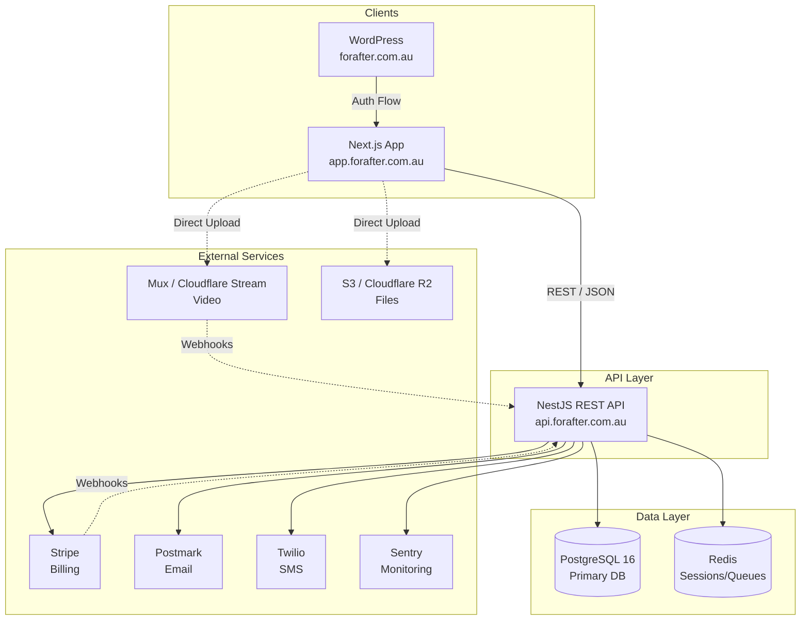
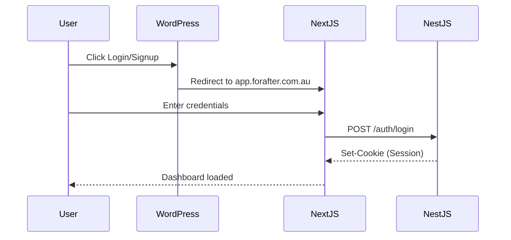
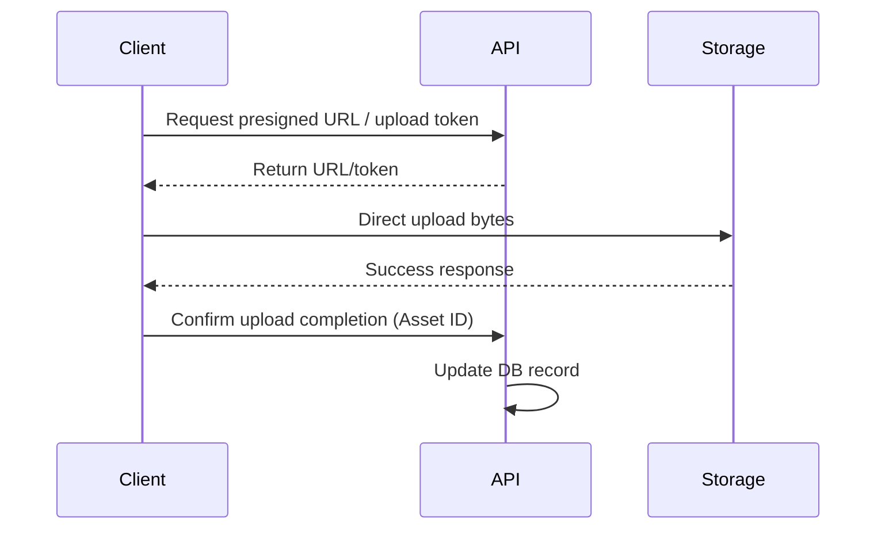

# For After — System Architecture

## 1. System Overview
**For After** is a Digital Legacy / Memory Vault SaaS platform. Users can create vaults filled with video messages, audio, text, photos, memories, and wishes. Recipients receive this content on scheduled dates, milestones, or after a verified death event.

## 2. Architecture Principles & Invariants
- **PostgreSQL as Source of Truth**: Permanent state lives in PostgreSQL (not Redis). Redis is strictly for ephemeral data (sessions, queues, caching).
- **Offloaded Media Processing**: Video uploads go directly from the client to Mux/Cloudflare Stream, bypassing the NestJS API to save bandwidth and compute.
- **Deny-by-default Recipient Access**: Recipients never see unreleased content. Access control explicitly checks release schedules and status.
- **Durable & Idempotent Delivery**: Database idempotency keys prevent duplicate sends in the delivery workers.
- **Human-in-the-loop Death Verification**: Multi-step workflow involving Trusted Contacts and Administrators to verify death before releasing posthumous content.
- **Timezone Semantics**: All timestamps are stored in UTC. Local timezones are stored separately for recurring rules and schedule calculations.

## 3. System Topology



## 4. NestJS Module Architecture

```text
src/
├── prisma/          (Global DB access)
├── auth/            (Customer auth, OTP, 2FA)
├── users/           (Profiles, account settings)
├── recipients/      (People I Love management)
├── trusted-contacts/ (Nomination, permissions)
├── messages/        (Message authoring, drafts)
├── media/           (Direct uploads, webhooks)
├── memories/        (Memory Vault, categorization)
├── story/           (Guided life story prompts)
├── wishes/          (Funeral/celebration preferences)
├── scheduling/      (Polling engine for due releases)
├── delivery/        (BullMQ workers, multi-channel dispatch)
├── death-verification/ (Multi-step verification)
├── subscriptions/   (Stripe billing, webhooks)
├── notifications/   (Postmark + Twilio)
├── storage/         (S3/R2 usage tracking)
├── admin/           (Backoffice operations)
├── audit/           (Immutable event logging)
└── common/          (Guards, filters, interceptors)
```

## 5. Data Flow Diagrams

### Authentication Flow


### Media Upload Flow


## 6. Technology Stack

| Component | Technology | Purpose |
| --- | --- | --- |
| **Frontend App** | Next.js | Dashboard, Vault, Admin interfaces |
| **Marketing Site** | WordPress | Landing pages, blog, initial login/signup forms |
| **Backend API** | NestJS (TypeScript, ESM) | Core business logic, REST endpoints |
| **Database** | PostgreSQL 16 | Primary relational data store |
| **ORM** | Prisma 7 | Type-safe database access |
| **Cache & Queues** | Redis, BullMQ | Session management, async task processing |
| **Video Processing**| Mux / Cloudflare Stream | Video encoding, hosting, and streaming |
| **File Storage** | AWS S3 / Cloudflare R2 | Static file and asset storage |
| **Payments** | Stripe | Subscriptions and billing |
| **Communications**| Postmark, Twilio | Transactional emails and SMS notifications |
| **Monitoring** | Sentry | Error tracking and performance monitoring |

## 7. Cross-Cutting Concerns
- **Logging**: Winston or Pino integrated with NestJS Logger.
- **Monitoring**: Sentry for error tracking and performance profiling.
- **Health Checks**: `@nestjs/terminus` for liveness/readiness probes (DB, Redis).
- **Rate Limiting**: `@nestjs/throttler` to prevent abuse, especially on auth and public endpoints.
- **Audit Trail**: Dedicated `audit` module logging critical actions (e.g., death verification steps, schedule changes) for compliance and debugging.
