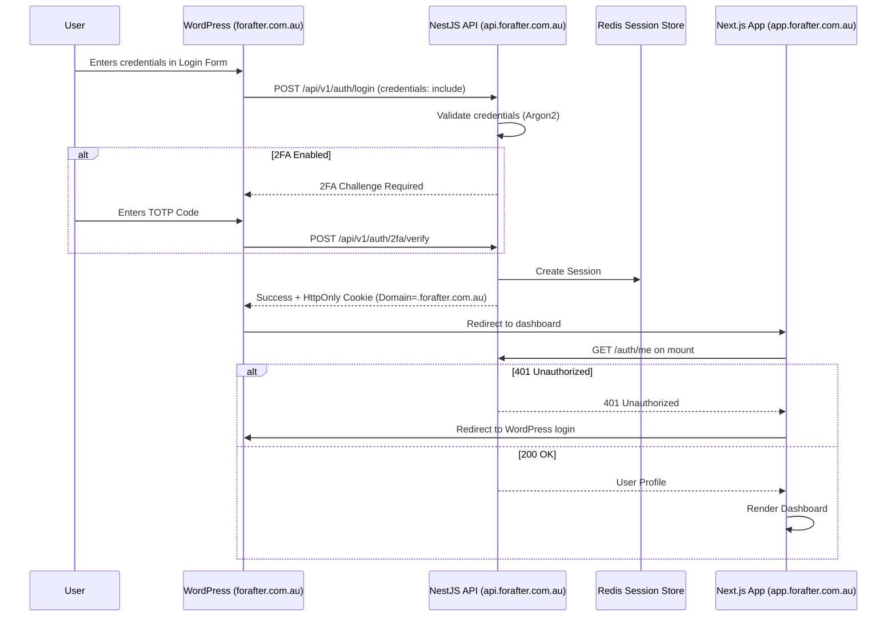

# For After — Authentication

This document details the authentication architecture, security implementations, and session management for the For After platform.

## 1. Authentication Strategy Overview

For After employs **Server-side sessions** with `HttpOnly` cookies. 
**JSON Web Tokens (JWT) stored in `localStorage` are explicitly rejected** for security reasons, specifically to protect sensitive vault data against Cross-Site Scripting (XSS) attacks.

## 2. Auth Flow

The standard authentication flow from WordPress to the app dashboard:

## 3. Password Security

We use **Argon2id** (memory-hard, GPU-resistant) for password hashing.
- **Cost Factor**: 12
- Plaintext passwords are **never** stored or logged.

## 4. Session Management

- **Session Store**: Redis via `connect-redis` + `express-session`
- **Cookie Configuration**: `HttpOnly`, `Secure`, `SameSite=Lax`, `Domain=.forafter.com.au`, `Path=/`
- **Audit Logging**: A session table in PostgreSQL for audit purposes with the following structure:
  - `id`
  - `user_id`
  - `session_token_hash`
  - `ip_address`
  - `user_agent`
  - `expires_at`
  - `last_used_at`
  - `revoked_at`
  - `created_at`

## 5. Registration Flow

1. `POST /auth/register`
2. Validate DTO (`email`, `password` min 8 chars, `firstName`, `lastName`).
3. Check email uniqueness in the database.
4. Hash password with Argon2.
5. Create `User` in PostgreSQL.
6. Send verification email via Postmark.
7. Return success response.

## 6. Email Verification

- Utilizes a single-use token.
- Endpoint: `POST /auth/verify-email` with the token.

## 7. Password Reset

1. `POST /auth/forgot-password` -> Generates an expiring token and sends an email.
2. `POST /auth/reset-password` -> Validates the token, updates the hash via Argon2, and **revokes all active sessions** for that user.

## 8. Two-Factor Authentication (2FA)

- **Strategy**: TOTP-based using `otplib` + `qrcode`.
- **Enforcement**: Optional for customers, **mandatory for admins**.
- **Setup**: `POST /auth/2fa/setup` -> returns a secret and a QR code.
- **Confirm**: `POST /auth/2fa/confirm` with the first TOTP code to fully enable.
- **Login Challenge**: If 2FA is enabled, `POST /auth/login` returns a challenge. The client must call `POST /auth/2fa/verify`.
- **Disable**: `POST /auth/2fa/disable` (requires password re-entry for security).

## 9. Recipient Authentication (OTP)

- **Strategy**: Passwordless authentication via a 6-digit one-time code sent via Email or SMS.
- **Security**: 10-minute validity, maximum 5 attempts, tracked in Redis.
- **Flow**:
  1. `POST /recipient-auth/request-code`
  2. `POST /recipient-auth/verify-code`
- **Outcome**: Creates a scoped recipient session. Recipients can **only** access released content mapped to their recipient ID.

## 10. Localhost Development

For development convenience, temporary `/dev-login` and `/dev-register` routes exist in the Next.js application. 
- These are controlled by the `NEXT_PUBLIC_APP_ENV` environment flag.
- In production, these routes redirect automatically to WordPress.

## 11. Security Anti-Patterns Explicitly Forbidden

- **NO** JWTs in `localStorage` or `sessionStorage`.
- **NO** tokens in URL query parameters.
- **NO** reliance on the WordPress `wp_users` table for application authentication. All application auth is handled natively by NestJS.

## Implementation Notes (Step 2)

What is built today, and where it differs from the target design above.

- **Endpoints** (prefix `/api/v1`): `POST /auth/register`, `POST /auth/login`, `GET /auth/me`, `POST /auth/logout`. Health checks stay unprefixed: `GET /health/database`, `GET /health/redis`.
- **Passwords**: Argon2id with the `argon2` library defaults (64 MiB memory, 3 passes). "Cost factor 12" above is bcrypt terminology and does not apply. Registration requires 12 to 128 characters with no composition rules (NIST SP 800-63B). Registration does not log the user in.
- **Sessions**: `express-session` + `connect-redis`, cookie `for_after_session`, Redis key prefix `for_after:sess:`. The session holds only `userId` and `role`. `SessionAuthGuard` reloads the user from PostgreSQL on every request, so a status change takes effect immediately. The session ID is regenerated on login, and logout destroys it and clears the cookie.
- **No MemoryStore fallback**: the app refuses to start if `REDIS_URL` or `SESSION_SECRET` is missing, or if Redis is unreachable at boot.
- **Account status**: only `ACTIVE` may sign in. `SUSPENDED`, `DELETED` and `PASSED` get `403 This account cannot sign in.`, but only after a correct password. **PASSED-account access is an open business decision**; it is deny-by-default until decided.
- **Rate limits**: register and login are limited to 5 requests per minute per IP, counted in memory per instance (move to Redis when running more than one instance).
- **Not yet built**: 2FA, email verification, password reset, and the PostgreSQL session-audit table.

### Cookie behaviour

| | Localhost | Production |
|---|---|---|
| `COOKIE_DOMAIN` | empty (host-only cookie) | `.forafter.com.au` |
| `Secure` | off (`NODE_ENV=development`) | on (`NODE_ENV=production`) |
| `SameSite` / `HttpOnly` | `Lax` / on | `Lax` / on |
| Trust proxy | off | 1 hop (AWS load balancer terminates TLS) |

Locally, `localhost:3000` (Next.js) and `localhost:4000` (API) are the same site, so the `Lax` cookie is sent on `fetch(..., { credentials: 'include' })`. In production, `forafter.com.au`, `app.forafter.com.au` and `api.forafter.com.au` share the `.forafter.com.au` cookie, so a login on the WordPress page is visible to the Next.js dashboard's `GET /auth/me`.

### Environment variables

| Variable | Required | Example / notes |
|---|---|---|
| `DATABASE_URL` | yes | PostgreSQL connection string |
| `REDIS_URL` | yes | `redis://localhost:6379` (`rediss://` for TLS in production) |
| `SESSION_SECRET` | yes | 32+ random characters, different per environment |
| `SESSION_TTL_SECONDS` | no | default `604800` (7 days) |
| `COOKIE_DOMAIN` | prod | `.forafter.com.au`; leave empty locally |
| `FRONTEND_URL` | for CORS | `http://localhost:3000` / `https://app.forafter.com.au` |
| `WORDPRESS_URL` | for CORS | comma-separated allowed: `https://forafter.com.au,https://www.forafter.com.au` |
| `NODE_ENV` | yes | `development` / `production` (controls `Secure` cookie and trust proxy) |
