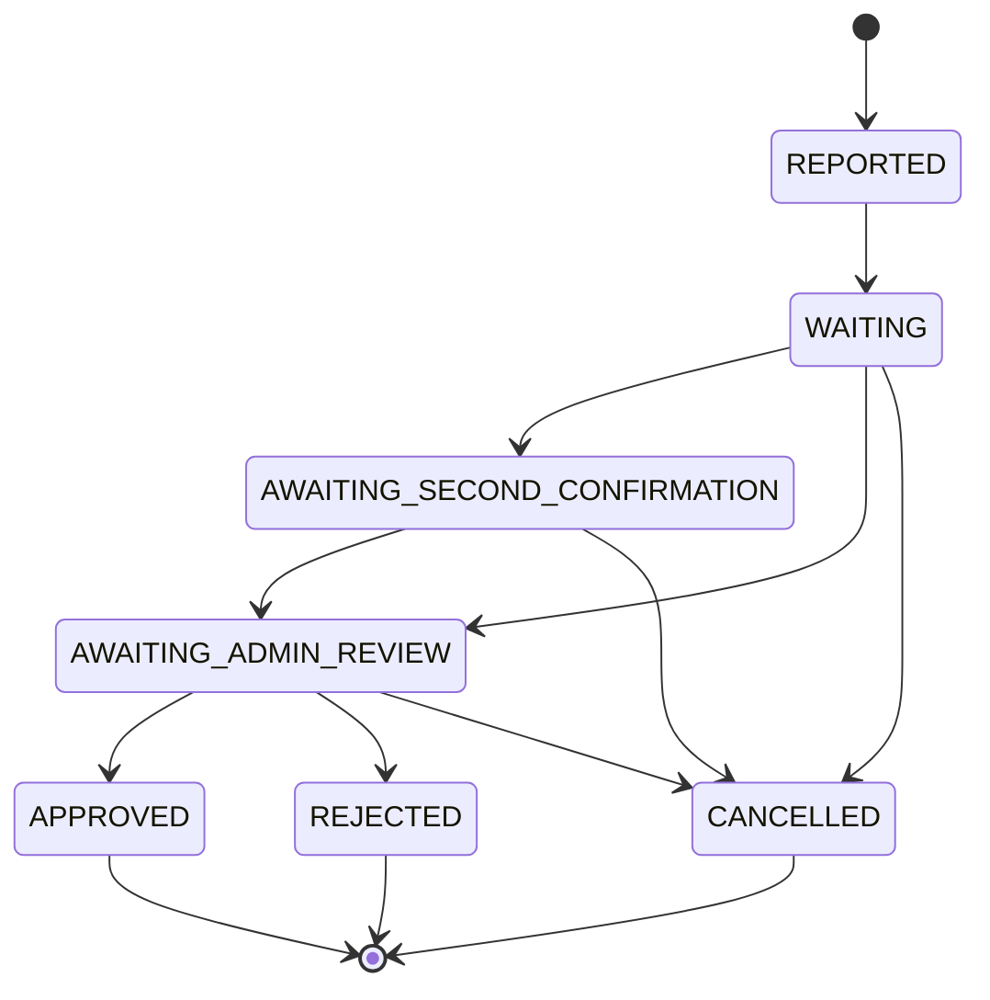

# For After — Death Verification Workflow

## 1. Overview
This is a critical, highly sensitive workflow. It must carefully balance timely message delivery with preventing false reports or premature releases. Human-in-the-loop is strictly required.

## 2. State Machine

## 3. Detailed Workflow Steps

1. **Step 1:** Trusted Contact reports death via portal (`POST /death-verifications/report`).
2. **Step 2:** Trusted Contact uploads evidence (death certificate, obituary, legal documents) which is stored in a private S3 bucket.
3. **Step 3:** Status moves to `WAITING`. A cooling-off/grace period begins (configurable, default is 14 days).
4. **Step 4:** System sends automated multi-channel contact attempts to the account holder (Email + SMS): *"A death report has been filed. If you are alive, click here to cancel."*
5. **Step 5:** If the account holder responds/clicks the link → report is `CANCELLED`. Account holder is notified.
6. **Step 6:** If a second trusted contact is configured → status moves to `AWAITING_SECOND_CONFIRMATION`. The second contact must confirm the report.
7. **Step 7:** Status moves to `AWAITING_ADMIN_REVIEW`. Admin reviews evidence and contact attempt history.
8. **Step 8a:** Admin **REJECTS** → reason logged, account holder notified, no content released.
9. **Step 8b:** Admin **APPROVES** → An atomic database transaction executes:
   - User status is updated to `PASSED`.
   - All `ON_DEATH` release schedules activate immediately.
   - All `AFTER_DEATH` schedules calculate their due dates.
   - BullMQ jobs are dispatched with calculated delay offsets.
   - `AuditLog` entry is written.

## 4. Data Models

### DeathReport
- `id`
- `subjectUserId`
- `reportedByTrustedContactId`
- `status`
- `reportedAt`
- `waitingPeriodEndsAt`
- `adminReviewedBy`
- `adminReviewedAt`
- `approvedAt`
- `rejectedAt`
- `rejectionReason`

### DeathDocument
- `id`
- `deathReportId`
- `objectKey`
- `documentType`
- `uploadedBy`
- `uploadedAt`

### DeathConfirmation
- `id`
- `deathReportId`
- `trustedContactId`
- `decision`
- `confirmedAt`
- `metadata` (JSONB)

## 5. Security Considerations
- **Rate-limiting:** Death reports are limited (e.g., 2/day per user) to prevent spam.
- **Privacy:** Evidence is stored in private S3 buckets, never public.
- **Auditability:** Every status change is logged in an audit trail.
- **Access Control:** Admin actions require 2FA to prevent unauthorized approval.

## 6. Edge Cases
- Multiple trusted contacts filing simultaneously.
- Account holder logs into the platform during the waiting period (acts as automatic cancellation).
- Rejected report re-submission.
- Admin timeout or delayed reviews affecting calculated delivery dates.
