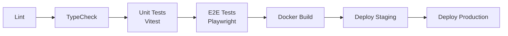

# For After — Deployment & Infrastructure

## 1. Hosting Region
All infrastructure is hosted in **AWS Sydney (ap-southeast-2)** to ensure strict Australian data residency and compliance.

## 2. Infrastructure Components
- **WordPress**: Managed WordPress hosting (for the marketing site).
- **Next.js Frontend**: Containerized and hosted on AWS ECS / AWS App Runner / Vercel.
- **NestJS Backend**: Containerized Docker deployment on AWS ECS / AWS App Runner.
- **Database (PostgreSQL)**: Managed instance (AWS RDS or Supabase) in the Sydney region.
- **Queue/Cache (Redis)**: Managed Redis cluster (AWS ElastiCache or Upstash).
- **Object Storage (S3)**: Private buckets in ap-southeast-2.
- **Video Processing (Mux)**: External SaaS service.

## 3. Domain Architecture

| Application | Domain | Platform |
|---|---|---|
| Marketing Site | `forafter.com.au` | WordPress |
| User Application | `app.forafter.com.au` | Next.js |
| API Services | `api.forafter.com.au` | NestJS |

## 4. CI/CD Pipeline
Pipelines are powered by **GitHub Actions** and execute the following sequence:

## 5. Docker Configuration
- We use a `Dockerfile` for the NestJS backend utilizing a multi-stage build process to optimize image size and security.
- Base images are Alpine or distroless Node.js images.

## 6. Environment Variables
- **Rule**: All secrets and configuration are managed via environment variables. NEVER commit secrets to code.
- In production, values are injected via **AWS Parameter Store** or **AWS Secrets Manager**.

## 7. Monitoring & Alerting
- **Error Tracking**: Sentry (`@sentry/nestjs`) for capturing backend exceptions.
- **Uptime Monitoring**: UptimeRobot for external service checks.
- **Health Checks**: `@nestjs/terminus` provides standardized `/health` endpoints.
- **Queue Metrics**: BullMQ Dashboard for visualizing background jobs.
- **Infrastructure Metrics**: AWS CloudWatch for logs, CPU, and memory utilization.

## 8. Backup Strategy
- **PostgreSQL**: Automated Point-in-Time Recovery (PITR) enabled.
- **S3 Storage**: Bucket versioning enabled to protect against accidental overwrites/deletions.
- Regular disaster recovery and backup restoration testing is mandated.

## 9. SSL/TLS
- All domains use **HTTPS with TLS 1.3**.
- Certificates are managed automatically via AWS Certificate Manager (ACM).
