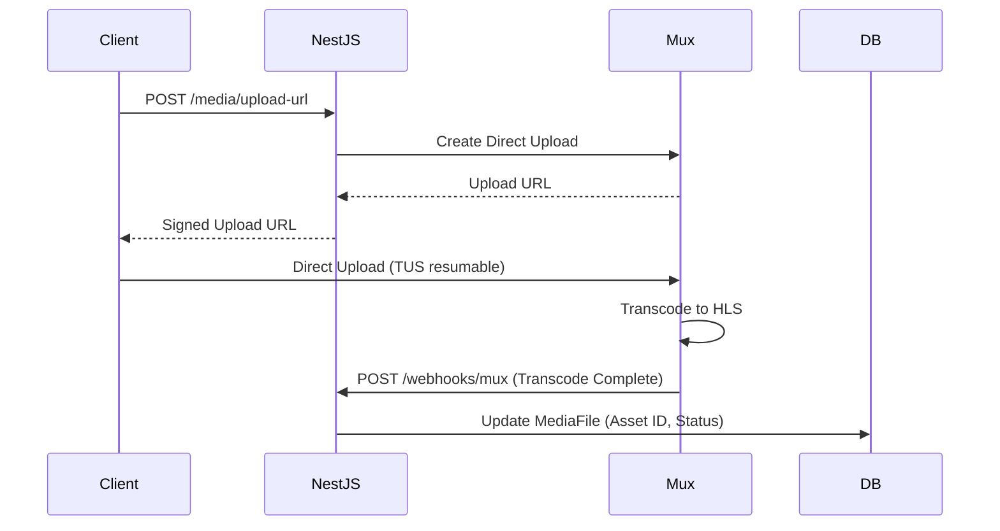

# For After — Media & Storage Architecture

## 1. Architecture Principle
**No large media files pass through the NestJS application server or database.** All uploads are direct from the client browser to specialized storage providers.

## 2. Video Pipeline (Mux / Cloudflare Stream)


- Playback: NestJS generates signed playback tokens with expiration for the client.

## 3. File Storage (AWS S3 / Cloudflare R2)
- **Used for**: photos, audio recordings, documents, death certificates, export ZIPs.
- **Buckets**: All buckets are strictly **PRIVATE** (no public access).
- **Upload**: NestJS generates a presigned PUT URL. The client uploads directly to the bucket.
- **Download**: NestJS generates a presigned GET URL with a time expiration. The client downloads the file.
- **Packages**: `@aws-sdk/client-s3`, `@aws-sdk/s3-request-presigner`

## 4. MediaFile Model

```prisma
model MediaFile {
  id               String   @id @default(uuid())
  ownerId          String
  messageId        String?
  memoryId         String?
  provider         String   // Mux, S3, R2
  providerAssetId  String?
  objectKey        String?
  mimeType         String
  fileSize         BigInt
  durationSeconds  Int?
  processingStatus String?
  checksum         String?
  status           String
  createdAt        DateTime @default(now())
}
```

## 5. Storage Quotas
- Quotas are enforced based on the user's plan:
  - **Basic**: 5GB
  - **Standard**: 25GB
  - **Legacy**: 100GB
- The `StorageUsage` model tracks `bytesUsed` against `byteLimit` per user.
- System rejects upload requests if the quota is exceeded.

## 6. Content Types Supported
- **Video**: MP4, WebM, MOV
- **Audio**: MP3, WAV, M4A, OGG
- **Images**: JPEG, PNG, WebP, HEIC
- **Documents**: PDF

## 7. Security
- All URLs are time-limited signed URLs.
- No public bucket policies allowed on any environments.
- Media access and downloads are logged in the `AuditLog`.
