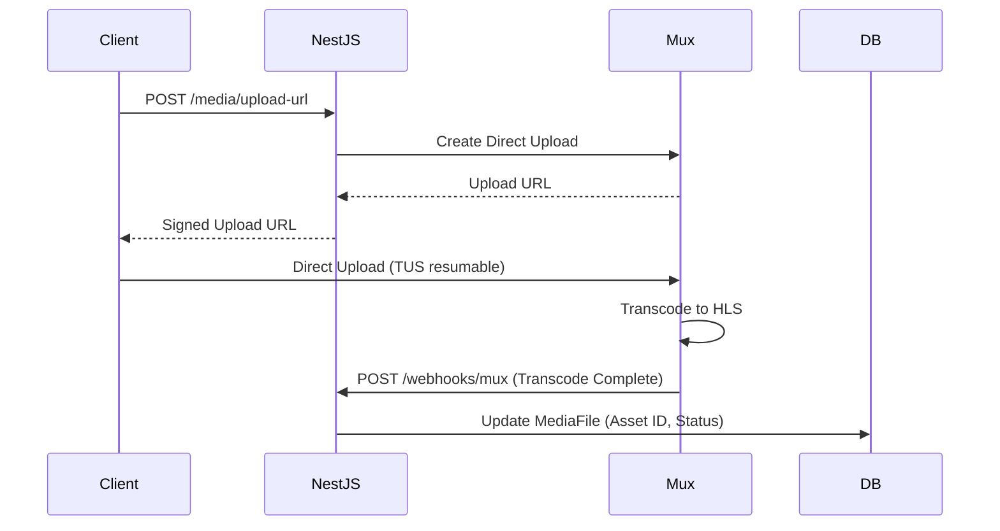

# For After — Media & Storage Architecture

## 1. Architecture Principle
**No large media files pass through the NestJS application server or database.** All uploads are direct from the client browser to specialized storage providers.

## 2. Implemented in Step 7: photos and audio (S3-compatible, private)

### Providers
- **Development:** a real **private Backblaze B2** bucket, used through its **S3-compatible API** (`@aws-sdk/client-s3`, `@aws-sdk/s3-request-presigner`).
  No Backblaze native SDK.
- **Provider-neutral design:** `MediaService` only knows the `MediaStorage` abstraction (`src/media/storage/media-storage.service.ts`).
  `S3MediaStorage` is the only place an `S3Client` is built. Switching to AWS S3, Cloudflare R2 or MinIO is a configuration change.
- **Production** must use a separate bucket and separate credentials.

### Configuration (`.env`, see `.env.example`)
| Variable | Notes |
|---|---|
| `OBJECT_STORAGE_PROVIDER` | Informational (`backblaze-b2`); every current provider uses the S3 adapter |
| `OBJECT_STORAGE_REGION` | Region only, e.g. `us-east-005`. A hostname here is refused at startup |
| `OBJECT_STORAGE_ENDPOINT` | e.g. `https://s3.<region>.backblazeb2.com` |
| `OBJECT_STORAGE_BUCKET` | Private bucket |
| `OBJECT_STORAGE_ACCESS_KEY_ID` / `OBJECT_STORAGE_SECRET_ACCESS_KEY` | A **standard application key restricted to that bucket**. Only in `.env` or a secret manager: never in code, docs, tests or logs |
| `OBJECT_STORAGE_FORCE_PATH_STYLE` | `false` for B2 (`true` is typical for MinIO) |
| `MEDIA_UPLOAD_URL_TTL_SECONDS` / `MEDIA_ACCESS_URL_TTL_SECONDS` | 600 / 300 by default |
| `MEDIA_PHOTO_MAX_BYTES` / `MEDIA_AUDIO_MAX_BYTES` | 20 MB / 100 MB by default |

Missing storage config **stops the app at startup** with the names of the missing variables (never their values). There is no fallback storage.

### Upload lifecycle
```
Client -> POST /messages/:id/media/upload-url   (NestJS: owner + DRAFT + kind/MIME/size checks)
          <- PENDING_UPLOAD row + presigned PUT (Content-Type signed, 10 min)
Client -> PUT file bytes directly to the bucket  (no cookie, no Authorization header)
Client -> POST .../complete                     (NestJS: HeadObject, compare size + type)
          -> READY (uploadedAt set) | FAILED (object removed) | 409 not uploaded yet
Client -> GET .../access-url                    <- presigned GET (5 min), READY only
Client -> DELETE ...                            (soft delete first, then DeleteObject, best-effort)
```
- `PENDING_UPLOAD -> READY` only after `HeadObject` confirms the size (and `Content-Type`, which is part of the upload signature).
  The client's `sizeBytes` is only the expected size.
- Mismatch -> `FAILED` (terminal; request a new upload URL). `complete` on `READY` is idempotent.
- Storage key: `users/{ownerUserId}/messages/{messageId}/{mediaAssetId}.{ext}`, where the extension comes from the allowlisted MIME type,
  never from the filename. It is server-generated and never returned.
- Signed URLs are never stored in PostgreSQL and never logged. Logs contain only IDs and error categories.
- There are no public URLs, no public ACLs and no permanent media links.
- Media on a `SCHEDULED` message can be listed and viewed but not changed. Unschedule first; nothing is unscheduled automatically.
- Step 8: uploads do not depend on the message's `contentType`; which media a message may have is checked when scheduling
  (`docs/message-composition.md`). Upload-url, complete and delete run inside a transaction that first locks the message row
  (conditional UPDATE requiring DRAFT), the same lock scheduling takes, so media cannot change while a schedule is being validated.
  As a side effect, a media change updates `Message.updatedAt`.
- No media URL fields on Message, and no external/Cloudinary URL import: all media goes through this private signed-URL flow.

### What Step 7 does not do
- **MIME type and size are not content validation.** Headers can be spoofed. There is no antivirus or malware scanning, magic-byte or
  file-signature inspection, image re-encoding, audio transcoding or content moderation. Step 7 does not prove an uploaded file is safe.
  Production hardening may add quarantine and scanning before `READY`.
- Until the signed PUT URL expires, the same URL could overwrite the object with a file of the same type (the READY size check has
  already passed). Short TTLs limit this; scanning or copy-on-complete would close it.
- **Pending-upload cleanup** (future): old `PENDING_UPLOAD` rows and their objects are cleaned up by a scheduled reconciliation job.
  There is no `setTimeout`.
- **Orphan-object reconciliation** (future): objects left behind when `DeleteObject` fails after a soft delete, or when a message is
  soft-deleted (Step 5 does not cascade to media).
- **Browser uploads** (future frontend): the bucket will need a **restricted CORS policy**: only the approved app origins, `PUT`/`GET`,
  and the `Content-Type` header. Never a wildcard in production. Postman needs no CORS.
- Video (below), thumbnails, waveforms, resizing, quotas and recipient access are all later steps.

### Testing
- Unit and e2e tests **mock `MediaStorage`** and never contact a real bucket or use credentials (e2e uses real PostgreSQL and sessions).
- The real B2 dev bucket is only for manual local integration testing (Postman).

## 2b. Video Pipeline (planned, not built: Mux / Cloudflare Stream)


- Playback: NestJS generates signed playback tokens with expiration for the client.

## 3. File Storage (planned scope beyond Step 7)
- **Used for**: photos, audio recordings, documents, death certificates, export ZIPs.
- **Buckets**: All buckets are strictly **PRIVATE** (no public access).
- **Upload**: NestJS generates a presigned PUT URL. The client uploads directly to the bucket.
- **Download**: NestJS generates a presigned GET URL with a time expiration. The client downloads the file.
- **Packages**: `@aws-sdk/client-s3`, `@aws-sdk/s3-request-presigner`

## 4. MediaFile Model (superseded by `MediaAsset`, see docs/database.md)

```prisma
model MediaFile {
  id               String   @id @default(uuid())
  ownerId          String
  messageId        String?
  memoryId         String?
  provider         String   // Mux, S3, R2
  providerAssetId  String?
  objectKey        String?
  mimeType         String
  fileSize         BigInt
  durationSeconds  Int?
  processingStatus String?
  checksum         String?
  status           String
  createdAt        DateTime @default(now())
}
```

## 5. Storage Quotas
- Quotas are enforced based on the user's plan:
  - **Basic**: 5GB
  - **Standard**: 25GB
  - **Legacy**: 100GB
- The `StorageUsage` model tracks `bytesUsed` against `byteLimit` per user.
- System rejects upload requests if the quota is exceeded.

## 6. Content Types (product target; Step 7 allows only the list in section 2)
- **Video**: MP4, WebM, MOV
- **Audio**: MP3, WAV, M4A, OGG
- **Images**: JPEG, PNG, WebP, HEIC
- **Documents**: PDF

## 7. Security
- All URLs are time-limited signed URLs.
- No public bucket policies allowed on any environments.
- Media access and downloads are logged in the `AuditLog`.
