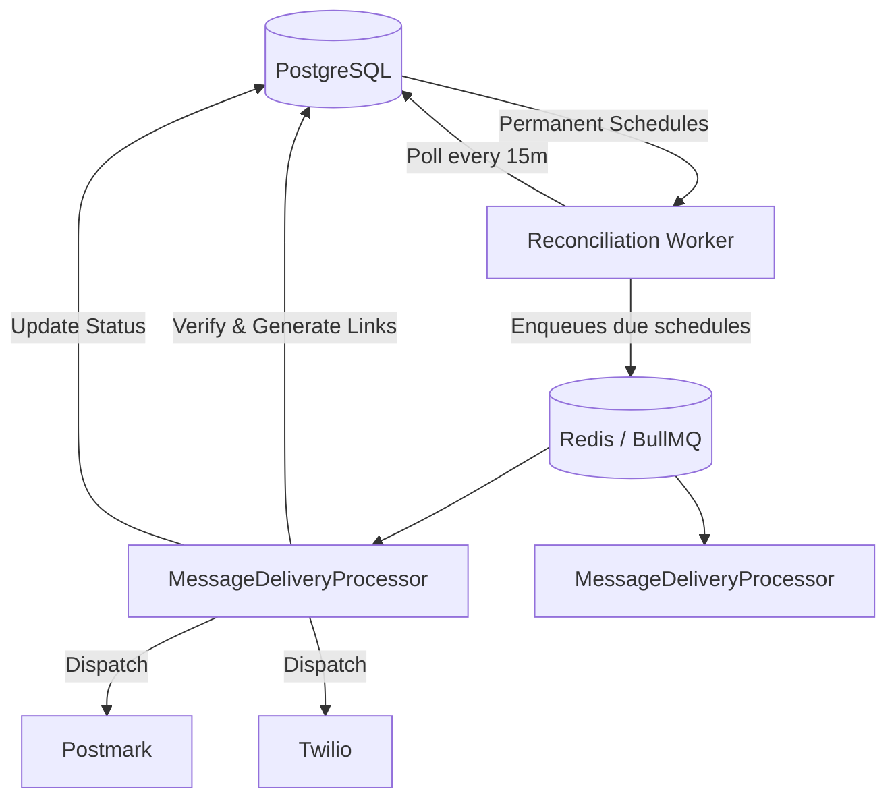

# For After — Scheduling & Delivery Engine

## 1. Overview
Messages are scheduled for delivery on specific triggers. Some schedules are years in the future (5-15 years). Because of this long-term requirement, we cannot rely solely on in-memory Redis queues and must persist schedules durably.

## 2. Release Schedule Types
The `ReleaseType` enum defines the trigger conditions for message delivery:

| Type | Description |
|---|---|
| `NOW` | Immediate release |
| `FIXED_DATE` | Specific future date/time |
| `BIRTHDAY` | Recurring annual on recipient's birthday |
| `ANNIVERSARY` | Recurring annual event |
| `CUSTOM_EVENT` | User-defined milestone |
| `ON_DEATH` | Released immediately when death is verified |
| `AFTER_DEATH` | Released X days/months/years after death |
| `ANNUAL_AFTER_DEATH` | Recurring annual releases after death |

## 3. Architecture



- **PostgreSQL** stores permanent schedules (`release_schedules` table).
- **Reconciliation worker** runs periodically (e.g., every 15 min), querying schedules due in the next 24h.
- Due schedules are enqueued into **BullMQ (Redis)**.
- **BullMQ workers** process delivery: verify state → generate signed links → dispatch email/SMS → update PostgreSQL.
- Long-term schedules (years away) are **NEVER** stored in Redis — only in PostgreSQL.

## 4. BullMQ Configuration

```typescript
import { BullModule } from '@nestjs/bullmq';
import IORedis from 'ioredis';

// Same REDIS_URL as sessions (rediss:// for TLS in production).
// BullMQ workers require maxRetriesPerRequest: null.
BullModule.forRoot({
  connection: new IORedis(process.env.REDIS_URL!, { maxRetriesPerRequest: null }),
});

BullModule.registerQueue({ 
  name: 'message-delivery' 
});
```

## 5. Worker Processing (`MessageDeliveryProcessor`)
When a job is picked up by a worker:
1. **Check idempotency**: Verify delivery hasn't already succeeded.
2. **Fetch schedule** from PostgreSQL source of truth.
3. **Verify state**: Ensure schedule is active & recipient is valid.
4. **Update state**: Mark `MessageRecipient` as released.
5. **Send notification**: Dispatch via Email (Postmark) and/or SMS (Twilio).
6. **Record Status**: Log delivery attempt and status.
7. **Audit**: Write to an append-only `AuditLog`.

## 6. Failure Recovery
- **Exponential Backoff**: Retries on failure (30s → 2m → 10m).
- **Dead Letter Queue (DLQ)**: Permanently failed jobs are moved here.
- **Alerting**: Admin alerts on DLQ items.
- **Validation**: Workers verify delivery status in PostgreSQL before sending to prevent duplicates.

## 7. Idempotency
To guarantee exact-once delivery, an `idempotencyKey` is used:
`idempotencyKey = ${messageId}-${recipientId}-${scheduleId}`
This is enforced as a `UNIQUE` constraint on the `deliveries` table in PostgreSQL.

## 8. Timezone Handling
- All timestamps are stored in **UTC**.
- Recurring rules (birthday, anniversary) store local timezone (e.g., `'Australia/Perth'`).
- The reconciliation worker calculates the next UTC occurrence dynamically based on the local time.

## 9. Death-Triggered Scheduling
- When a death report is **approved**, all `ON_DEATH` schedules activate immediately.
- `AFTER_DEATH` schedules calculate their due date: `approvedAt + relativeAmount * relativeUnit = dueAt`.
