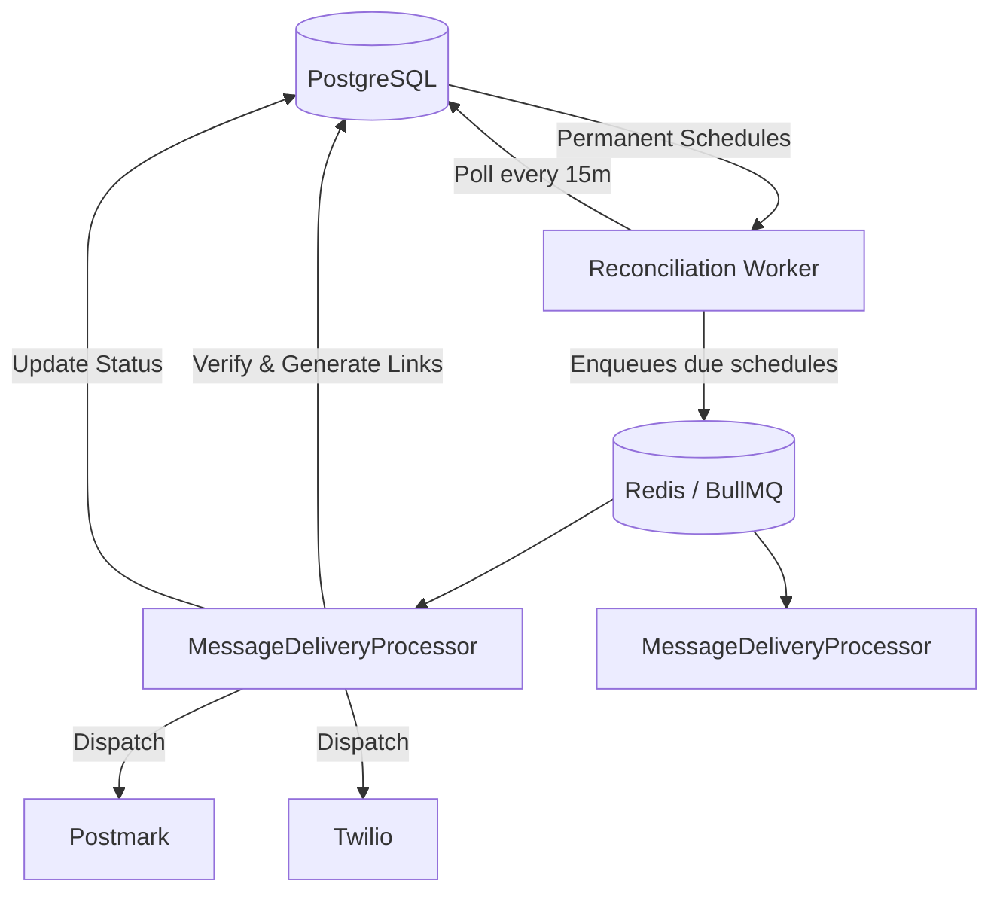

# For After — Scheduling & Delivery Engine

## 1. Overview
Messages are scheduled for delivery on specific triggers. Some schedules are years in the future (5-15 years). Because of this long-term requirement, we cannot rely solely on in-memory Redis queues and must persist schedules durably.

## 2. Release Trigger Types
The `ReleaseTriggerType` enum defines the trigger conditions. All values exist in the database; the API accepts only the Step 6 ones.

| Type | Description | Step 6 |
|---|---|---|
| `NOW` | Immediate release | Reserved: no release engine or recipient access exists, so accepting it would claim a release that cannot happen |
| `FIXED_DATE` | Specific future instant | **Supported** |
| `BIRTHDAY` | Recurring annual on recipient's birthday | Reserved: needs decisions on timezone (recipient vs owner), time of day, 29 Feb, several recipients with different birthdays, recurrence |
| `ANNIVERSARY` | Recurring annual event | Reserved: needs the event date model and the same recurrence/timezone decisions |
| `CUSTOM_EVENT` | User-defined milestone | Reserved: needs an event model and who confirms the event |
| `ON_DEATH` | Released when death is verified | **Supported** (dormant until death verification exists) |
| `AFTER_DEATH` | Released N days after verified death | **Supported** as `afterDeathDays` 0-36,500 (dormant) |
| `ANNUAL_AFTER_DEATH` | Recurring annual releases after death | Reserved: needs recurrence semantics and per-year occurrences |

## 2a. What Step 6 implements (and does not)
- `MessageSchedule` in PostgreSQL, **one per message** (unique `messageId`). PostgreSQL is the only source of truth: nothing is kept only in Redis, BullMQ or memory, and there is no `setTimeout`.
- API: `POST/GET/PATCH/DELETE /api/v1/messages/:messageId/schedule` (see `docs/api.md`).
- Status transitions, all server-side and atomic with the schedule change (Prisma transaction, conditional `UPDATE` on the message row first):
  - `DRAFT -> SCHEDULED` by creating the schedule (requires an own, non-deleted DRAFT message with at least one non-deleted assigned recipient and no schedule).
  - `SCHEDULED -> SCHEDULED` when editing the schedule.
  - `SCHEDULED -> DRAFT` by deleting the schedule (hard delete). This is *not* `CANCELLED`.
  - No Step 6 path creates `RELEASED`; `RELEASED`/`CANCELLED` messages cannot be scheduled, edited or unscheduled (409).
- `FIXED_DATE` needs an explicit offset (`Z` or `+hh:mm`); it is stored as a UTC instant and must be in the future when set.
- `ON_DEATH`/`AFTER_DEATH` stay dormant until verified-death infrastructure exists. Step 6 never checks death, creates reports or touches `passedAt`.
- A database CHECK constraint enforces the per-trigger field rules, so no future code path can store an unsupported or contradictory schedule without a deliberate migration.
- Not built: execution, BullMQ, release, delivery, notifications, recipient access.
- Known edge case: a recipient soft-deleted *after* scheduling does not change the schedule. The release engine must re-check assignments at release time (and decide what to do if none remain).

## 3. Architecture



- **PostgreSQL** stores permanent schedules (`MessageSchedule` table, Step 6).
- **Reconciliation worker** runs periodically (e.g., every 15 min), querying schedules due in the next 24h.
- Due schedules are enqueued into **BullMQ (Redis)**.
- **BullMQ workers** process delivery: verify state → generate signed links → dispatch email/SMS → update PostgreSQL.
- Long-term schedules (years away) are **NEVER** stored in Redis — only in PostgreSQL.

### Planned execution flow (not built)
```
PostgreSQL MessageSchedule
  -> Scheduler / reconciliation service (finds schedules due soon)
  -> BullMQ near-term job
  -> Worker
  -> Re-read PostgreSQL (never trust the job payload)
  -> Validate Message (SCHEDULED, not deleted) + schedule + live recipients
  -> Idempotent release operation
  -> Delivery / recipient access
```
PostgreSQL stays authoritative throughout; Redis only holds short-lived execution jobs.

### Per-recipient resolution (future)
One message may target several recipients. For triggers such as `BIRTHDAY` each recipient can resolve to a different release date,
so the release engine will create per-recipient `ReleaseOccurrence`/`Delivery` rows. `MessageSchedule` is deliberately *not* duplicated per recipient.

## 4. BullMQ Configuration (planned)

```typescript
import { BullModule } from '@nestjs/bullmq';
import IORedis from 'ioredis';

// Same REDIS_URL as sessions (rediss:// for TLS in production).
// BullMQ workers require maxRetriesPerRequest: null.
BullModule.forRoot({
  connection: new IORedis(process.env.REDIS_URL!, { maxRetriesPerRequest: null }),
});

BullModule.registerQueue({ 
  name: 'message-delivery' 
});
```

## 5. Worker Processing (`MessageDeliveryProcessor`)
When a job is picked up by a worker:
1. **Check idempotency**: Verify delivery hasn't already succeeded.
2. **Fetch schedule** from PostgreSQL source of truth.
3. **Verify state**: Ensure schedule is active & recipient is valid.
4. **Update state**: Mark `MessageRecipient` as released.
5. **Send notification**: Dispatch via Email (Postmark) and/or SMS (Twilio).
6. **Record Status**: Log delivery attempt and status.
7. **Audit**: Write to an append-only `AuditLog`.

## 6. Failure Recovery
- **Exponential Backoff**: Retries on failure (30s → 2m → 10m).
- **Dead Letter Queue (DLQ)**: Permanently failed jobs are moved here.
- **Alerting**: Admin alerts on DLQ items.
- **Validation**: Workers verify delivery status in PostgreSQL before sending to prevent duplicates.

## 7. Idempotency
To guarantee exact-once delivery, an `idempotencyKey` is used:
`idempotencyKey = ${messageId}-${recipientId}-${scheduleId}`
This is enforced as a `UNIQUE` constraint on the `deliveries` table in PostgreSQL.

## 8. Timezone Handling
- All timestamps are stored in **UTC**.
- Recurring rules (birthday, anniversary) store local timezone (e.g., `'Australia/Perth'`).
- The reconciliation worker calculates the next UTC occurrence dynamically based on the local time.

## 9. Death-Triggered Scheduling
- When a death report is **approved**, all `ON_DEATH` schedules activate immediately.
- `AFTER_DEATH` schedules calculate their due date: `dueAt = approvedAt + afterDeathDays days`.
