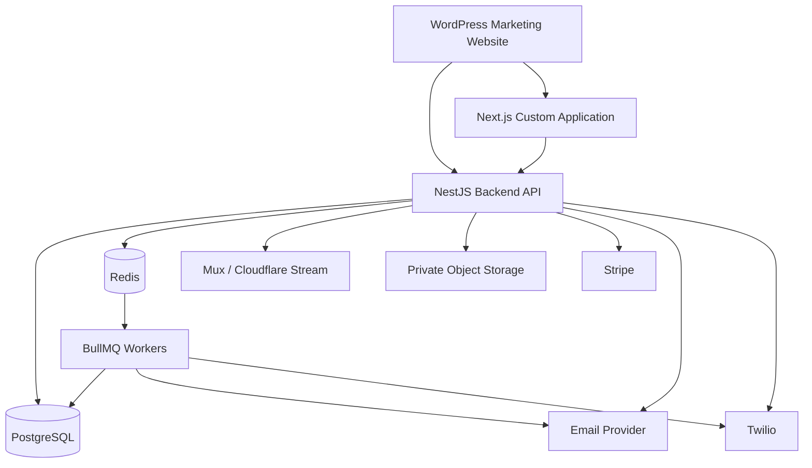

# 🕊️ For After — Project Overview & System Guide

> The product brief and system guide for For After. It describes the **target** product; "As built" notes mark where
> the backend already implements a section. Section numbers (§1–§62) are stable and referenced by other docs.

| | |
|---|---|
| **Project** | For After |
| **Type** | Secure Digital Legacy & Posthumous Messaging SaaS web application |
| **Platform** | Responsive web application |
| **Marketing site** | WordPress |
| **Custom dashboard** | Next.js + React + TypeScript (Steps 17–19 built: Customer app, Recipient and Trusted Contact portals) |
| **Backend** | NestJS + TypeScript (Steps 1–16 built) |
| **Database** | PostgreSQL + Prisma |
| **Queue / background jobs** | Redis + BullMQ |
| **Status** | MVP development: backend Steps 1–16, frontend Steps 17–19 ([task.md](task.md)) |

## 📍 Where we are today

| Area | Brief sections | Status |
|---|---|---|
| Customer auth, sessions | §7, §33–§36 | ✅ Built (password login, Redis sessions); 2FA, reset, email verification planned |
| People I Love, Trusted Contacts (CRUD) | §12, §19 | ✅ Built |
| Messages, media, composition | §13–§14, §25 | ✅ Built (TEXT/PHOTO/AUDIO/MIXED); video planned |
| Memory Vault, My Story, My Wishes | §16–§18 | ✅ Built (text + photo/audio where applicable) |
| Scheduling + release | §15, §29–§32 | 🟡 `FIXED_DATE`, `ON_DEATH`, `AFTER_DEATH` stored; `FIXED_DATE` executed; delivery not built |
| Recipient Portal | §6B, §22–§23 | ✅ Built (email OTP, released content only); SMS + email provider planned |
| Trusted Contacts + death verification | §5.3, §19–§21 | ✅ Steps 14–15: email OTP, reports, safety notice, safeguard, confirm-alive, admin verify/reject, death-trigger release · ⬜ evidence, second confirmation |
| Admin backend, audit | §40–§42 | ✅ Step 16: admin API with mandatory TOTP, user management, audit log, queues · ⬜ admin UI |
| Billing, notifications, export | §38–§39, §52–§53 | ⬜ Not started |
| Frontend (all portals), WordPress login | §6, §7, §11 | 🟡 Customer app, vault, Recipient and Trusted Contact portals built (25 of 30 tasks) · ⬜ profile, billing, admin UI, WordPress login |

## 🧭 Contents

| Part | Sections |
|---|---|
| **The product** | [1 What is For After](#1-what-is-for-after) · [2 Project type](#2-what-type-of-project-is-this) · [3 Product structure](#3-product-structure) · [4 Experience](#4-product-experience) · [5 User types](#5-main-user-types) · [6 Portals](#6-main-application-portals) |
| **Access** | [7 Production login](#7-production-login--signup-architecture) · [8 Local login](#8-local-development-login) |
| **Technology** | [9 Stack](#9-recommended-technology-stack) · [10 Architecture](#10-high-level-architecture) |
| **Features** | [11 Dashboard](#11-customer-dashboard) · [12 People I Love](#12-people-i-love) · [13 Message creation](#13-message-creation-flow) · [14 Status lifecycle](#14-message-status-lifecycle) · [15 Schedule types](#15-release-schedule-types) · [16 Memory Vault](#16-memory-vault) · [17 My Story](#17-my-story) · [18 My Wishes](#18-my-wishes) |
| **After death** | [19 Trusted Contacts](#19-trusted-contact-workflow) · [20 Death verification](#20-death-verification-workflow) · [21 Statuses](#21-death-verification-statuses) · [22 Recipient experience](#22-recipient-experience) · [23 Recipient auth](#23-recipient-authentication) |
| **Media and data** | [24 Video](#24-video-architecture) · [25 Private files](#25-private-file-architecture) · [26 PostgreSQL](#26-postgresql-role) · [27 Prisma](#27-prisma-role) · [28 Redis](#28-redis-role) · [29 BullMQ](#29-bullmq-role) · [30 Long-term scheduling](#30-long-term-scheduling-rule) · [31 Reliability](#31-delivery-reliability) · [32 Idempotency](#32-idempotency) |
| **Security** | [33 Authentication](#33-authentication-security) · [34 Sessions](#34-session-security) · [35 Admin](#35-admin-security) · [36 AuthN vs AuthZ](#36-authentication-vs-authorization) · [37 Core requirements](#37-core-security-requirements) · [38 Audit logging](#38-audit-logging) |
| **Business** | [39 Subscriptions](#39-subscription-system) · [40 After death](#40-subscription-after-death) · [41 Storage quotas](#41-storage-quotas) · [42 Admin dashboard](#42-admin-dashboard) |
| **Engineering** | [43 API structure](#43-api-structure) · [44 Auth endpoints](#44-example-authentication-endpoints) · [45 Local env](#45-local-development-environment) · [46 Environments](#46-environment-strategy) · [47 Hosting](#47-production-hosting) · [48 CI/CD](#48-cicd) · [49 Testing](#49-testing-strategy) · [50 Security tests](#50-critical-security-test-cases) · [51 Backups](#51-backup-strategy) · [52 Export](#52-data-export) · [53 Deletion](#53-account-deletion) |
| **Planning** | [54 MVP exclusions](#54-mvp-exclusions) · [55 Modules](#55-recommended-backend-modules) · [56 Docs](#56-recommended-documentation) · [57 AI rules](#57-ai-development-rules) · [58 Open decisions](#58-major-business-decisions-still-required) · [59 Sequence](#59-recommended-development-sequence) · [60 First milestone](#60-first-development-milestone) · [61 Example flow](#61-example-complete-product-flow) · [62 Success criteria](#62-project-success-criteria) |

---

## 1. What Is For After?

**For After** is a private digital legacy platform that allows people to record, store, organize, and schedule personal content for loved ones.

The core idea is simple:

> A user should be able to leave meaningful messages, memories, stories, and wishes for specific people and decide exactly when those items become available.

A user may create content for delivery:

- Immediately
- On a fixed future date
- On a birthday
- On an anniversary
- On another custom milestone
- On the day their death is verified
- A specific number of days, weeks, months, or years after death
- Annually after death, if enabled

The platform must ensure that the **correct private content reaches the correct person at the intended time and remains inaccessible before release**.

---

## 2. What Type of Project Is This?

For After is best described as a:

**Digital Legacy SaaS Platform**

It combines several product types:

- Digital Memory Vault
- Future Message Scheduling Platform
- Posthumous Messaging Platform
- Private Recipient Portal
- Trusted Contact Verification System
- Subscription SaaS Product
- Secure Media Storage Platform
- Administrative Operations Platform

It is **not just a normal website**.

The project has two main parts:

1. A public WordPress marketing website
2. A separate secure custom web application

---

## 3. Product Structure

### 3.1 WordPress Marketing Website

Recommended domain:

```text
https://forafter.com.au
```

WordPress is responsible for:

- Home
- About
- How It Works
- Features
- Pricing
- FAQ
- Contact
- Login UI
- Signup UI
- Forgot Password UI
- SEO
- Marketing content

WordPress is **not** the source of truth for application users.

---

### 3.2 Custom Web Application

Recommended domain:

```text
https://app.forafter.com.au
```

The custom application contains the actual product functionality:

- Dashboard
- Messages
- People I Love
- Memory Vault
- My Story
- My Wishes
- Trusted Contacts
- Billing
- Profile
- Security
- Recipient Portal
- Admin Portal
- Death Verification
- Delivery Management

---

### 3.3 Backend API

Recommended domain:

```text
https://api.forafter.com.au
```

NestJS handles:

- Authentication
- Sessions
- Authorization
- Users
- Recipients
- Messages
- Scheduling
- Death Verification
- Billing
- Media metadata
- Notifications
- Admin APIs
- Audit logs

---

## 4. Product Experience

The product should feel:

- Warm
- Calm
- Personal
- Premium
- Respectful
- Private
- Simple
- Emotionally considered

It should not feel like:

- A hospital portal
- A legal document repository
- A funeral management system
- A cold enterprise dashboard
- A complicated file-storage website

The emotional experience is especially important for:

- Someone creating a message for a loved one
- A trusted contact reporting a death
- A recipient opening a message from someone they have lost

---

## 5. Main User Types

### 5.1 Account Owner / Customer

The main paying user.

They can:

- Manage profile
- Manage subscription
- Add loved ones
- Add trusted contacts
- Create messages
- Record video
- Record audio
- Upload photos
- Write messages
- Create memories
- Answer My Story prompts
- Record My Wishes
- Assign recipients
- Schedule releases
- View storage usage
- Export content
- Manage security settings

---

### 5.2 Recipient / Loved One

A person selected to receive content.

Examples:

- Child
- Partner
- Parent
- Sibling
- Friend
- Grandchild

A recipient should only see content that:

1. Was assigned to them
2. Has already been released

Unreleased content must remain hidden.

---

### 5.3 Trusted Contact

A person nominated by the Account Owner to help with sensitive post-death actions.

Possible responsibilities:

- Report death
- Upload supporting evidence
- Confirm death
- Update allowed recipient contact details
- View verification status

A Trusted Contact should **not automatically gain access to unreleased content** unless that content was personally assigned to them.

> ✅ **As built (Steps 14–15):** Trusted Contacts sign in by email code (not a `User`, no password). They can **report
> death** and **view verification status**; only an admin can verify. Evidence upload, confirmation and updating
> recipient details are not built yet. They see no content at all, only whether preserved content exists (true/false).
> See [trusted-contact-auth.md](trusted-contact-auth.md).

---

### 5.4 Administrator

An internal platform operator.

Admins may manage:

- Users
- Subscriptions
- Storage
- Failed deliveries
- Death verification
- Billing issues
- Support
- Audit logs
- Operational monitoring

Admin access should be highly controlled.

---

## 6. Main Application Portals

### A. Customer Portal

Main location:

```text
app.forafter.com.au/dashboard
```

Core sections:

```text
Dashboard
Messages
People I Love
Memory Vault
My Story
My Wishes
Trusted Contacts
Billing
Profile
Security
Settings
```

---

### B. Recipient / Trusted Contact Portal

Recipients access a private environment containing only released content.

Recommended flow:

```text
Email / Mobile
    ↓
One-Time Code
    ↓
Secure Recipient Session
    ↓
Released Content
```

Recipients should be able to return later and revisit released content.

Trusted Contacts may use the same portal with additional controls based on permissions.

> ✅ **As built:** the backend keeps the two apart. Recipients (Step 13) and Trusted Contacts (Step 14) each have their
> own sign-in routes, cookie and session, and neither session works on the other's routes. A future UI can still
> present them in one portal.

---

### C. Admin Portal

Recommended location:

```text
app.forafter.com.au/admin
```

Possible sections:

```text
Dashboard
Users
Subscriptions
Storage
Death Verifications
Delivery Queue
Failed Jobs
Support
Audit Logs
System Health
```

---

## 7. Production Login & Signup Architecture

The custom dashboard does **not** contain the main production customer login/signup page.

Production login and signup are on WordPress:

```text
https://forafter.com.au/login
https://forafter.com.au/signup
```

However, WordPress only provides the user interface.

Authentication is handled by NestJS.

### Production Login Flow

```text
User visits forafter.com.au/login
        ↓
Enters Email + Password
        ↓
WordPress form calls NestJS API
        ↓
NestJS validates credentials
        ↓
PostgreSQL user record checked
        ↓
Secure server-side session created
        ↓
HttpOnly secure cookie issued
        ↓
Login successful
        ↓
Redirect
        ↓
app.forafter.com.au/dashboard
```

The user experiences this as one seamless product.

---

## 8. Local Development Login

During development, WordPress is not required.

A temporary development-only login page can be created:

```text
http://localhost:3000/dev-login
```

Development flow:

```text
Next.js Dev Login
        ↓
NestJS
http://localhost:4000/api/v1/auth/login
        ↓
PostgreSQL
        ↓
Secure local session
        ↓
http://localhost:3000/dashboard
```

In production, `/dev-login` should not be available.

---

## 9. Recommended Technology Stack

### Frontend

```text
Next.js
React
TypeScript
Tailwind CSS
shadcn/ui
React Hook Form
Zod
TanStack Query
Lucide React
```

### Backend

```text
Node.js
NestJS
TypeScript
Prisma
PostgreSQL
Redis
BullMQ
```

### Authentication

```text
NestJS authentication
Argon2id password hashing
Server-side sessions
HttpOnly secure cookies
Redis-backed session/rate-limit support
TOTP 2FA where required
```

### Video

```text
Mux or Cloudflare Stream
```

### Private Files

```text
AWS S3 or Cloudflare R2
```

For:

- Photos
- Audio
- Documents
- Death evidence
- Export archives

### Communication

```text
Postmark / AWS SES
Twilio
```

### Payments

```text
Stripe Billing
```

### Monitoring

```text
Nest Observe
Sentry
Cloud monitoring
Queue alerts
Uptime monitoring
```

---

## 10. High-Level Architecture



---

## 11. Customer Dashboard

The dashboard is built with:

```text
Next.js + React + TypeScript + Tailwind CSS + shadcn/ui
```

Recommended dashboard homepage:

```text
Welcome back, Lisa

My Messages
People I Love
My Memories
My Story
My Wishes

Upcoming Messages
Storage Usage
Subscription Plan
Trusted Contacts
```

The dashboard should feel simple and calm rather than like a complex enterprise admin panel.

---

## 12. People I Love

The user creates profiles for recipients.

Possible fields:

```text
First Name
Last Name
Relationship
Email
Mobile
Photo
Private Note
Birthday
Other useful dates
```

Each recipient can have:

- Assigned messages
- Memories
- Scheduled content
- Released content
- Contact information

---

## 13. Message Creation Flow

Recommended six-step flow:

```text
1. Select Recipient(s)
2. Choose Content Type
3. Record / Upload Content
4. Add Title / Context
5. Choose Delivery Trigger
6. Review & Confirm
```

Supported content types may include:

```text
VIDEO
AUDIO
TEXT
PHOTO
MIXED
```

---

## 14. Message Status Lifecycle

Recommended lifecycle:

```text
DRAFT
   ↓
SCHEDULED
   ↓
RELEASED
```

Alternative terminal state:

```text
CANCELLED
```

A released message should not casually return to a scheduled state.

---

## 15. Release Schedule Types

### NOW

Release immediately.

### FIXED_DATE

Release on a specific future date.

### BIRTHDAY

Release on a recipient's birthday.

Business decision required:

- Once only?
- Every year?

### ANNIVERSARY

Release on an annual anniversary.

### CUSTOM_EVENT

Examples:

- Wedding day
- Graduation
- Birth of a child
- Other future occasion

### ON_DEATH

Release when the user's death is approved.

### AFTER_DEATH

Examples:

```text
1 week after death
1 month after death
6 months after death
1 year after death
```

### ANNUAL_AFTER_DEATH

Release every year after verified death.

Exact recurrence rules still require final product approval.

---

## 16. Memory Vault

The Memory Vault stores personal content.

Possible content:

- Photos
- Videos
- Audio
- Letters
- Stories
- Recipes
- Life lessons

Possible categories:

```text
Family
Travel
Childhood
Funny Stories
Life Lessons
Recipes
Love Stories
```

Possible features:

- Search
- Filter
- Categories
- Tags
- Edit
- Delete
- Recipient assignment
- Future scheduling if enabled

---

## 17. My Story

My Story helps users document their life using guided prompts.

Possible categories:

```text
Childhood
Family
Parents
School
Relationships
Career
Travel
Favourite Memories
Life Lessons
Values
Advice
```

Answer formats may include:

- Text
- Video
- Audio
- Photos

The final prompt set must be approved during discovery.

---

## 18. My Wishes

My Wishes is a personal preference section.

It is **not intended to be a legally binding Will** unless the platform is later legally designed for that purpose.

Possible fields:

- Burial / cremation
- Funeral location
- Celebration-of-life location
- Music
- Readings
- Flowers
- Clothing
- Speakers
- Photos
- People to contact
- Messages to play
- Charity preference
- Religious/cultural preferences
- Personal notes

A clear legal disclaimer should be considered.

---

## 19. Trusted Contact Workflow

```text
Account Owner
        ↓
Nominates Trusted Contact
        ↓
Invitation sent
        ↓
Trusted Contact verifies identity
        ↓
Trusted Contact receives limited permissions
```

Potential permissions:

```text
REPORT_DEATH
UPLOAD_DEATH_EVIDENCE
CONFIRM_DEATH
UPDATE_RECIPIENT_EMAIL
UPDATE_RECIPIENT_MOBILE
VIEW_VERIFICATION_STATUS
```

Exact permissions remain a client/business decision.

> ✅ **As built (Step 14):** identity is verified by email code at sign-in (no invitation step yet). Effective
> permissions today: `REPORT_DEATH` and `VIEW_VERIFICATION_STATUS`. The rest are not built.
>
> ✅ **Phase 10 (2026-10-06):** maximum 2 active Trusted Contacts per Customer; email invitation with accept/decline (SMS
> invitations and SMS OTP deferred); formal V1 permission model ([trusted-contact-auth.md](trusted-contact-auth.md) §11):
> report death and start a new case after a `REJECTED`/`CANCELLED` one, never any preserved content.

---

## 20. Death Verification Workflow

This is one of the most important workflows.

Recommended process:

```text
Trusted Contact reports death
        ↓
Supporting evidence uploaded
        ↓
Death report created
        ↓
Waiting period starts
        ↓
Account holder contacted by email/SMS
        ↓
If account holder responds:
Process cancelled
        ↓
If no response:
Second confirmation if required
        ↓
Admin review
        ↓
Approve / Reject
        ↓
If approved:
User marked as passed
        ↓
Death-based schedules activate
```

No death-based content should release before required verification is completed.

> ✅ **As built (Steps 14–15):** report → account-holder safety notice (email, console in development) → safeguard
> waiting period (default 14 days, starts only after a successful notice) → Customer can confirm alive (cancel) →
> admin review → verify or reject → verified: user marked `PASSED`, `ON_DEATH`/`AFTER_DEATH` schedules activate.
> **Not built:** evidence upload and second-confirmation rules (a second report is supporting information only).
> See [death-verification.md](death-verification.md).

---

## 21. Death Verification Statuses

Recommended:

```text
REPORTED
WAITING
AWAITING_SECOND_CONFIRMATION
AWAITING_ADMIN_REVIEW
APPROVED
REJECTED
CANCELLED
```

> ✅ **As built (Step 15):** `PENDING_VERIFICATION` (≈ `REPORTED`) → `SAFEGUARD_ACTIVE` (≈ `WAITING`) →
> `READY_FOR_REVIEW` (≈ `AWAITING_ADMIN_REVIEW`) → `VERIFIED` (≈ `APPROVED`) / `REJECTED`; `CANCELLED` by the
> Customer. `AWAITING_SECOND_CONFIRMATION` is not built.

---

## 22. Recipient Experience

The recipient experience is one of the emotional centres of the platform.

Example:

```text
Lisa left something for you.

For Sofia
On Your Wedding Day

[ Play Message ]
```

The recipient portal should:

- Be simple
- Be mobile-friendly
- Be private
- Display only released content
- Support secure streaming
- Allow downloads only if product rules permit

---

## 23. Recipient Authentication

Recommended passwordless flow:

```text
Enter email / mobile
        ↓
One-time code
        ↓
Verify
        ↓
Recipient session
        ↓
Released content
```

OTP requirements:

- Short lifetime
- Limited attempts
- Single use
- Rate limited

> ✅ **As built (Step 13):** email codes only (SMS later), 10-minute lifetime, 5 attempts, single use, per-email and
> per-IP rate limits, HMAC-stored in Redis. See [recipient-portal.md](recipient-portal.md).

---

## 24. Video Architecture

Video should not normally pass through the NestJS server.

Recommended flow:

```text
Browser
        ↓
Request direct upload URL
        ↓
NestJS
        ↓
Mux / Cloudflare Stream
        ↓
Signed upload URL
        ↓
Browser uploads directly
        ↓
Provider processes video
        ↓
Webhook to NestJS
        ↓
PostgreSQL media metadata updated
```

Benefits:

- Better large-file handling
- Resumable uploads
- Less backend load
- Adaptive streaming
- Secure playback

---

## 25. Private File Architecture

Photos, audio, documents, and death-verification evidence should use private object storage.

Upload:

```text
Browser
        ↓
Request signed upload
        ↓
NestJS permission check
        ↓
Short-lived signed URL
        ↓
Direct upload
```

Download:

```text
Authenticated request
        ↓
Permission check
        ↓
Temporary signed URL
        ↓
File access
```

Files must not be permanently public.

---

## 26. PostgreSQL Role

PostgreSQL is the permanent source of truth.

It stores:

- Users
- Recipients
- Trusted Contacts
- Messages
- Schedules
- Delivery records
- Death reports
- Confirmations
- Memories
- Story responses
- Wishes
- Subscription state
- Audit logs

Large video files should not be stored in PostgreSQL.

---

## 27. Prisma Role

Prisma is used for:

- Database schema
- Migrations
- Typed queries
- Database client generation

Development flow:

```text
schema.prisma
        ↓
Prisma migration
        ↓
PostgreSQL
        ↓
NestJS PrismaService
```

---

## 28. Redis Role

Redis stores fast temporary state.

Uses may include:

- Sessions
- Rate limiting
- OTP attempt tracking
- Temporary authentication state
- BullMQ queue state

Redis is **not** the permanent source of truth.

---

## 29. BullMQ Role

BullMQ handles background jobs.

Examples:

- Scheduled releases
- Email sending
- SMS sending
- Retries
- Data export
- Storage recalculation
- Verification reminders
- Cleanup jobs

---

## 30. Long-Term Scheduling Rule

Messages may be scheduled many years into the future.

Therefore:

> Long-term schedules must live permanently in PostgreSQL.

Recommended:

```text
PostgreSQL
Permanent schedule
        ↓
Scheduler service
        ↓
Near-term BullMQ job
        ↓
Worker
        ↓
Release
```

Do not rely on a single Redis delayed job surviving for many years.

---

## 31. Delivery Reliability

The delivery engine should support:

- Retries
- Failure logging
- Idempotency
- Alerting
- Reconciliation

Example:

```text
Release job
        ↓
Attempt
        ↓
Failure
        ↓
Retry
        ↓
Failure
        ↓
Retry
        ↓
Repeated failure
        ↓
Admin alert
```

No critical job should silently disappear.

---

## 32. Idempotency

The same message must not accidentally release twice.

Possible idempotency key:

```text
schedule_id + recipient_id + occurrence
```

The database should enforce uniqueness where practical.

---

## 33. Authentication Security

Customer authentication:

```text
Email
Password
Optional 2FA
```

Passwords should be hashed using:

```text
Argon2id
```

Never store plaintext passwords.

---

## 34. Session Security

Recommended:

- Server-side sessions
- HttpOnly cookies
- Secure cookies
- SameSite controls
- Session expiry
- Session revocation
- Device/session tracking

Do not place long-lived auth tokens in URLs.

Do not use localStorage as the primary authentication-token store for this architecture.

---

## 35. Admin Security

Recommended admin authentication:

```text
Email
Password
Mandatory TOTP 2FA
```

Additional controls:

- Shorter sessions
- Audit logging
- Re-authentication for sensitive actions
- Role-based permissions

---

## 36. Authentication vs Authorization

Authentication asks:

> Who is this person?

Authorization asks:

> What are they allowed to access?

Examples:

```text
Customer A
cannot access
Customer B's messages.
```

```text
Recipient Sofia
can access only
released content assigned to Sofia.
```

```text
Trusted Contact John
can report a death
but cannot automatically read private messages.
```

Recommended controls:

- NestJS guards
- Ownership checks
- Role/capability checks
- PostgreSQL Row-Level Security where appropriate

---

## 37. Core Security Requirements

Minimum security architecture:

- HTTPS
- TLS
- Argon2id
- HttpOnly cookies
- Secure sessions
- Rate limiting
- Helmet
- DTO validation
- Request size limits
- Authorization guards
- Row-Level Security where appropriate
- Private object storage
- Signed URLs
- Encryption at rest
- Audit logging
- Backups
- Monitoring
- Secret management

---

## 38. Audit Logging

Important events should be recorded.

Examples:

```text
USER_CREATED
USER_EMAIL_CHANGED
RECIPIENT_UPDATED
TRUSTED_CONTACT_INVITED
TRUSTED_CONTACT_REVOKED
MESSAGE_CREATED
MESSAGE_SCHEDULED
MESSAGE_CANCELLED
MESSAGE_RELEASED
DEATH_REPORTED
DEATH_CONFIRMED
DEATH_VERIFICATION_APPROVED
DEATH_VERIFICATION_REJECTED
ADMIN_LOGIN
ADMIN_UPDATED_USER
ACCOUNT_EXPORT_REQUESTED
ACCOUNT_DELETE_REQUESTED
```

Never store passwords, OTP values, or private message content in audit metadata.

---

## 39. Subscription System

Stripe should manage billing.

Potential features:

- Free trial
- Monthly subscription
- Annual subscription
- Upgrade
- Downgrade
- Cancellation
- Failed-payment handling
- Billing portal
- Invoices

Plan limits may include:

- Storage
- Video duration
- Number of recipients
- Number of trusted contacts

Exact commercial plans remain a business decision.

---

## 40. Subscription After Death

This is still a business decision.

Possible approaches:

- Stop billing
- Transfer billing to family
- One-time preservation fee
- Lifetime preservation plan
- Export period and account closure
- Release content then delete after notice

This must be finalised before production.

---

## 41. Storage Quotas

Every subscription should have a defined storage allowance.

Possible placeholder tiers:

```text
Basic: 5 GB
Standard: 25 GB
Legacy: 100 GB
```

These are placeholders until approved.

Dashboard example:

```text
12.4 GB used of 25 GB
```

Potential warning levels:

```text
80%
90%
100%
```

---

## 42. Admin Dashboard

Possible admin modules:

### Users

- Search users
- View account state
- View plan
- View storage
- Support actions

### Subscriptions

- Active
- Cancelled
- Past due
- Billing state

### Deliveries

- Scheduled
- Released
- Failed
- Retry

### Death Verification

- Pending
- Waiting
- Awaiting second confirmation
- Awaiting admin review
- Approved
- Rejected

### Audit Logs

- Actor
- Action
- Time
- Resource

---

## 43. API Structure

Recommended:

```text
/api/v1/auth
/api/v1/users
/api/v1/recipients
/api/v1/trusted-contacts
/api/v1/messages
/api/v1/media
/api/v1/memories
/api/v1/story
/api/v1/wishes
/api/v1/schedules
/api/v1/death-verification
/api/v1/subscriptions
/api/v1/admin
```

---

## 44. Example Authentication Endpoints

```text
POST /api/v1/auth/register
POST /api/v1/auth/login
POST /api/v1/auth/logout
GET  /api/v1/auth/me

POST /api/v1/auth/verify-email
POST /api/v1/auth/forgot-password
POST /api/v1/auth/reset-password
```

Recipient auth:

```text
POST /api/v1/recipient-auth/request-code
POST /api/v1/recipient-auth/verify-code
```

> ✅ **As built:** named `request-otp` / `verify-otp` (Step 13), plus the same pair for Trusted Contacts under
> `/api/v1/trusted-contact-auth` (Step 14). Full list: [for-after-api-endpoints-step-1-to-13.md](for-after-api-endpoints-step-1-to-13.md).

---

## 45. Local Development Environment

Recommended ports:

```text
Next.js:       localhost:3000
NestJS:        localhost:4000
PostgreSQL:    localhost:5432
Redis:         localhost:6379
Prisma Studio: localhost:5555
```

---

## 46. Environment Strategy

### Development

Developer machine.

### Staging

Used for:

- QA
- Client review
- Integration testing
- Stripe test mode
- Workflow testing

### Production

Real customers and real data.

Development and staging must never use production secrets.

---

## 47. Production Hosting

Recommended Australian region.

Example:

```text
AWS Sydney
ap-southeast-2
```

Alternatives:

- Azure Australia East
- Google Cloud Sydney

Final infrastructure provider can be selected later.

---

## 48. CI/CD

Recommended:

```text
GitHub
+
GitHub Actions
```

Pipeline:

```text
Push
↓
Lint
↓
Type Check
↓
Tests
↓
Build
↓
Deploy Staging
↓
E2E Tests
↓
Approval
↓
Deploy Production
```

---

## 49. Testing Strategy

### Unit Tests

Test:

- Scheduling logic
- Permission logic
- Death-verification state
- Entitlements
- Storage calculations

### Integration Tests

Test:

- PostgreSQL
- Stripe webhooks
- BullMQ
- Media webhooks
- Sessions

### End-to-End Tests

Test:

- Registration
- Login
- Recipient creation
- Message creation
- Scheduling
- Recipient access
- Death verification
- Billing
- Export/deletion

---

## 50. Critical Security Test Cases

Test:

- User attempts another user's message
- Recipient changes recipient ID
- Trusted Contact tries to read unreleased media
- Expired signed URL reused
- OTP brute-force attempt
- Fake death report
- Duplicate death approval
- Stripe webhook replay
- BullMQ duplicate retry
- Upload URL reused by another user
- Deleted recipient attempts old access
- Unauthorized admin action

---

## 51. Backup Strategy

PostgreSQL:

- Automated backups
- Point-in-time recovery
- Retention policy
- Restore testing

Object storage:

- Versioning/lifecycle where appropriate
- Backup/replication according to risk requirements

A backup should not be considered reliable until restoration has been tested.

---

## 52. Data Export

Users should be able to export their content.

Export should run as a background job.

Possible export:

```text
Messages
Photos
Audio
Videos
My Story
My Wishes
Metadata
Recipient assignments
```

The resulting archive should be private and temporary.

---

## 53. Account Deletion

Deletion requires a defined legal/product policy.

Possible workflow:

```text
Deletion request
        ↓
Re-authentication
        ↓
Grace period
        ↓
Export opportunity
        ↓
Schedules cancelled
        ↓
Media deleted
        ↓
Personal data deleted/anonymised
```

Exact retention rules must be confirmed before production.

---

## 54. MVP Exclusions

The initial MVP does not require:

- Native iOS app
- Native Android app
- AI features
- Fully automated death verification
- Hospital integration
- Charity integration
- White-label partner platform
- Family-shared collaborative vaults
- Physical printed books
- Multi-language support

These can be considered in future phases.

---

## 55. Recommended Backend Modules

```text
src/
├── auth/
├── users/
├── recipients/
├── trusted-contacts/
├── messages/
├── media/
├── memories/
├── story/
├── wishes/
├── scheduling/
├── delivery/
├── death-verification/
├── subscriptions/
├── notifications/
├── storage/
├── admin/
├── audit/
├── webhooks/
├── prisma/
└── common/
```

---

## 56. Recommended Documentation

```text
docs/
├── PROJECT_OVERVIEW.md
├── PRD.md
├── architecture.md
├── security.md
├── authentication.md
├── authorization.md
├── database.md
├── api.md
├── threat-model.md
├── scheduling.md
├── death-verification.md
├── media-storage.md
├── deployment.md
└── incident-response.md
```

Root:

```text
AGENTS.md
README.md
.env.example
```

---

## 57. AI Development Rules

AI coding assistants should:

1. Read project documentation before changing architecture.
2. Never invent business requirements.
3. Never expose unreleased content.
4. Never store plaintext passwords.
5. Never put authentication tokens in URLs.
6. Never commit secrets.
7. Never make Redis the long-term source of truth.
8. Make release jobs idempotent.
9. Audit sensitive death-verification/admin actions.
10. Add dependencies only when required.
11. Use Prisma migrations for schema changes.
12. Keep controllers thin.
13. Put business logic in services.
14. Validate incoming DTOs.
15. Never bypass authorization checks for convenience.

---

## 58. Major Business Decisions Still Required

### Trusted Contacts

- One or two?
- Mandatory?
- Replacement rules?
- Exact permissions?
- Can they see titles?
- Can they see that unreleased content exists?

> 🟡 **Step 14 interim answer (please confirm):** no titles; only a true/false "preserved content exists" flag. Open
> follow-ups from Step 14 are tracked in [task.md](task.md) (Part 1).

### Death Verification

- Accepted evidence
- Waiting period
- Contact frequency
- Second confirmation rules
- Human review
- Manual override rules

### Scheduling

- Recurring birthday rules
- Annual messages
- Custom events
- Reminders
- Edit/cancel rules

### Subscription After Death

- Billing owner
- Preservation option
- Export period
- Closure rules
- Lifetime plan

### Storage

- Limits
- Add-ons
- Video duration
- Warning thresholds

### Recipient Access

- Downloads?
- Original quality?
- Permanent access?
- Sharing?

---

## 59. Recommended Development Sequence

```text
01 Product Decisions
↓
02 PostgreSQL + Prisma
↓
03 NestJS Foundation
↓
04 Authentication
↓
05 Sessions + Authorization
↓
06 Local Development Login
↓
07 Next.js Dashboard Shell
↓
08 User Profile
↓
09 People I Love
↓
10 Trusted Contacts
↓
11 Messages
↓
12 Media
↓
13 Memory Vault
↓
14 My Story
↓
15 My Wishes
↓
16 Scheduling
↓
17 Redis + BullMQ
↓
18 Recipient Portal
↓
19 Death Verification
↓
20 Notifications
↓
21 Stripe
↓
22 Admin Portal
↓
23 Audit + Security
↓
24 Testing
↓
25 WordPress Authentication Integration
↓
26 Staging
↓
27 Production
```

---

## 60. First Development Milestone

The first end-to-end milestone:

```text
Create User
↓
Store User in PostgreSQL
↓
Login through NestJS
↓
Create Session
↓
GET /auth/me
↓
Open Next.js Dashboard
```

Development:

```text
Next.js dev login
→ NestJS
→ PostgreSQL
→ Dashboard
```

Production:

```text
WordPress login
→ NestJS
→ PostgreSQL
→ Next.js Dashboard
```

Only the login UI changes.

The authentication backend remains the same.

---

## 61. Example Complete Product Flow

Lisa creates an account.

```text
Lisa
↓
Adds Sofia as daughter
↓
Records a wedding-day video
↓
Assigns video to Sofia
↓
Schedules it for Sofia's wedding
↓
Video stored securely
↓
Schedule stored in PostgreSQL
```

When the release becomes valid:

```text
Scheduler
↓
BullMQ job
↓
Worker validates permissions and schedule
↓
Release record created
↓
Sofia notified
↓
Sofia verifies OTP
↓
Sofia opens recipient portal
↓
Sofia watches video
```

For a death-based message:

```text
Release 1 year after Lisa's death
```

It remains inactive until:

```text
Trusted Contact reports death
↓
Evidence uploaded
↓
Waiting period
↓
Required confirmations
↓
Admin approval
↓
Lisa marked as passed
↓
Death-relative schedule calculated
↓
Release occurs at the correct future time
```

---

## 62. Project Success Criteria

For After is successful when:

- Users can securely create private legacy content.
- Recipients cannot access content early.
- Scheduled releases happen reliably.
- Death-based releases cannot activate before approval.
- Users can manage loved ones and trusted contacts.
- Media remains private.
- Failed deliveries are detected and recoverable.
- Admins can operate the platform safely.
- User content can be exported.
- Backups can be restored.
- The system can scale without a complete rebuild.

---

# Core Promise

> **The correct private content reaches the correct person at the intended time, and remains inaccessible until all release conditions have been satisfied.**
