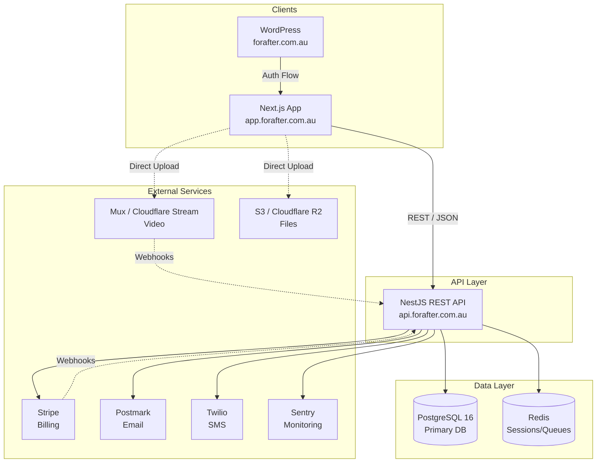
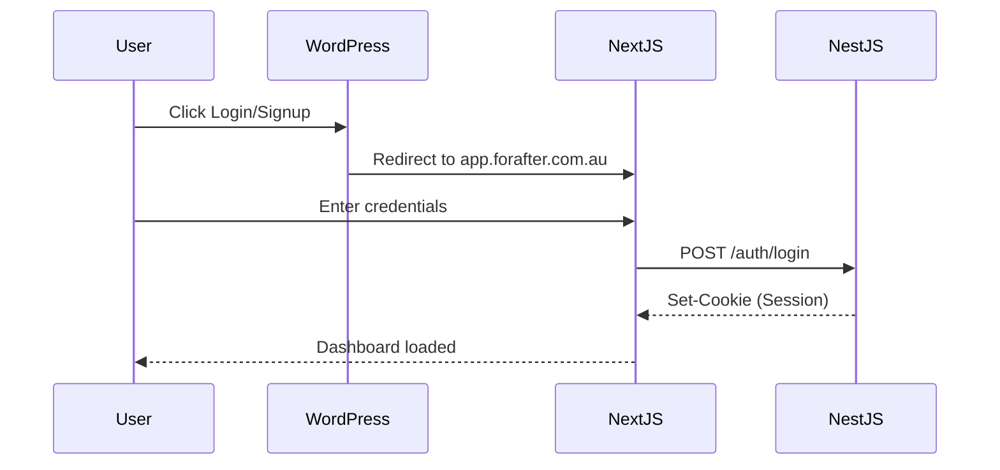
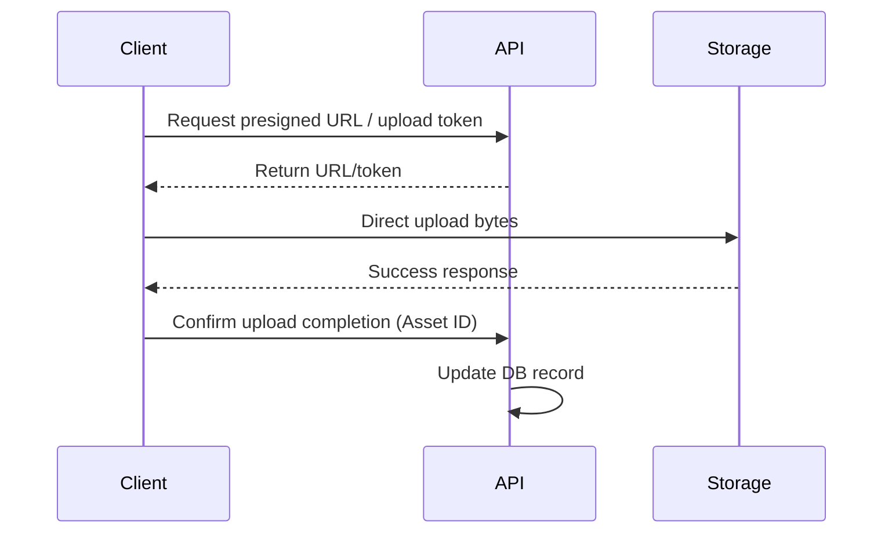

# 🏛️ For After — System Architecture

> How the pieces fit: WordPress, the Next.js app, the NestJS API, PostgreSQL, Redis/BullMQ and object storage, with
> the data flows that are already built.

| | |
|---|---|
| **Built** | NestJS API Steps 1–16 (Customer vault, release engine, Recipient Portal, Trusted Contact reports, death verification + death-trigger release, admin backend with mandatory TOTP + audit log) |
| **Frontend** | Next.js app (`for-after-frontend`, Steps 17–19): Customer app and vault, Recipient portal, Trusted Contact portal |
| **Not built** | Admin UI, WordPress integration, delivery, billing |
| **Related** | [Database](database.md) · [Security](security.md) · [Deployment](deployment.md) |

## 🧭 Contents

1. [System overview](#1-system-overview)
2. [Architecture principles and invariants](#2-architecture-principles--invariants)
3. [System topology](#3-system-topology)
4. [NestJS module architecture](#4-nestjs-module-architecture)
5. [Data flow diagrams](#5-data-flow-diagrams)
6. [Technology stack](#6-technology-stack)
7. [Cross-cutting concerns](#7-cross-cutting-concerns)

---

## 1. System Overview
**For After** is a Digital Legacy / Memory Vault SaaS platform. Users can create vaults filled with video messages, audio, text, photos, memories, and wishes. Recipients receive this content on scheduled dates, milestones, or after a verified death event.

## 2. Architecture Principles & Invariants
- **PostgreSQL as Source of Truth**: Permanent state lives in PostgreSQL (not Redis). Redis is strictly for ephemeral data (sessions, queues, caching).
- **Offloaded Media Processing**: Video uploads go directly from the client to Mux/Cloudflare Stream, bypassing the NestJS API to save bandwidth and compute.
- **Deny-by-default Recipient Access**: Recipients never see unreleased content. Access control explicitly checks release schedules and status.
- **Durable & Idempotent Delivery**: Database idempotency keys prevent duplicate sends in the delivery workers.
- **Human-in-the-loop Death Verification**: Multi-step workflow involving Trusted Contacts and Administrators to verify death before releasing posthumous content. *As built (Step 15): report → safety notice → safeguard → explicit admin verification; nothing is released on a report or an elapsed safeguard.*
- **Separate principals**: Customers, Recipients and Trusted Contacts have separate cookies, sessions and guards; none authorizes another's routes.
- **Timezone Semantics**: All timestamps are stored in UTC. Local timezones are stored separately for recurring rules and schedule calculations.

## 3. System Topology



## 4. NestJS Module Architecture

```text
src/
├── prisma/          (Global DB access)
├── auth/            (Customer auth, OTP, 2FA)
├── users/           (Profiles, account settings)
├── recipients/      (People I Love management)
├── trusted-contacts/ (Nomination, permissions)
├── messages/        (Message authoring, drafts)
├── media/           (Direct uploads, webhooks)
├── memories/        (Memory Vault, categorization)
├── story/           (Guided life story prompts)
├── wishes/          (Funeral/celebration preferences)
├── scheduling/      (Polling engine for due releases)
├── message-release/ (Step 12: BullMQ release worker + reconciler, FIXED_DATE only; Step 13: access grants)
├── recipient-auth/  (Step 13: Recipient email OTP, own cookie + Redis sessions, RecipientSessionAuthGuard)
├── recipient-portal/ (Step 13: read-only released Messages + media for Recipients)
├── otp-auth/        (Step 14: shared email OTP + Redis session engine used by recipient-auth and trusted-contact-auth)
├── trusted-contact-auth/ (Step 14: Trusted Contact email OTP, own cookie + Redis sessions, TrustedContactSessionAuthGuard)
├── trusted-contact-portal/ (Step 14: account list, death report, case status; no content access)
├── delivery/        (BullMQ workers, multi-channel dispatch)
├── death-verification/ (Steps 14–15: report intake, safety notice + safeguard queue, confirm-alive, admin verify/reject (paginated + audited in Step 16), death-trigger activation)
├── admin-auth/      (Step 16: admin TOTP setup/confirm/verify, recovery codes, Redis MFA challenges; /auth/login delegates admins here)
├── subscriptions/   (Stripe billing, webhooks)
├── notifications/   (Postmark + Twilio)
├── storage/         (S3/R2 usage tracking)
├── admin/           (Step 16: dashboard, users search/detail/suspend/reactivate, audit viewer, queue monitor + failed-job retry)
├── audit/           (Step 16: append-only AuditLog + writeAuditLog helper; DB trigger blocks UPDATE/DELETE)
└── common/          (Guards, filters, interceptors)
```

## 5. Data Flow Diagrams

### Authentication Flow


### Media Upload Flow


### Message release (Step 12, implemented)
```
Schedule API (commit in PostgreSQL) --best-effort sync--> BullMQ job "message-release-<messageId>" (id only)
Reconciler (startup + every 60 s) --reads PostgreSQL, rebuilds missing/late jobs within 24 h--> BullMQ
Worker --locks + re-reads PostgreSQL--> SCHEDULED -> RELEASED + MessageRelease (one transaction), or no-op
```
PostgreSQL is authoritative; Redis only holds near-term execution jobs and can be lost without losing a schedule.
FIXED_DATE only; ON_DEATH/AFTER_DEATH wait for death verification. Release is not delivery (no email/SMS yet).
The worker runs inside the API process for now. Details: `docs/message-release.md`.

### Recipient Portal (Step 13, implemented)
```
Release transaction --> MessageRelease + RecipientMessageAccessGrant per live Recipient (email/mobile snapshot) + RELEASED
Recipient --POST /recipient-auth/request-otp {email}--> 202 always; code (HMAC in Redis, 10 min) sent only if a grant exists
Recipient --POST /recipient-auth/verify-otp--> Redis session + HttpOnly cookie for_after_recipient_session (not for_after_session)
Recipient --GET /recipient/messages[...]--> grant for verified email + RELEASED + not deleted, checked in PostgreSQL each time
```
Recipients are not Users. Customer and Recipient guards, cookies and sessions are separate. Email delivery is provider-neutral
(`RecipientOtpDelivery`); no provider is wired in yet. Details: `docs/recipient-portal.md`.

### Trusted Contact death report intake (Step 14, implemented)
```
Trusted Contact --POST /trusted-contact-auth/request-otp {email}--> 202 always; code sent only to an active TrustedContact email
Trusted Contact --POST /trusted-contact-auth/verify-otp--> Redis session + HttpOnly cookie for_after_trusted_contact_session
Trusted Contact --GET /trusted-contact/accounts--> Customers listing this email: display name, hasPreservedContent, case status
Trusted Contact --POST /trusted-contact/accounts/:id/death-reports--> DeathVerificationCase (1 per Customer, PENDING_VERIFICATION)
                                                                  + DeathReport (1 per contact, reporter snapshot)
```
A report alone changes no `User`, Message, schedule, release or access grant. Customer, Recipient and Trusted Contact are
three separate principals with separate cookies, sessions and guards. Details: `docs/trusted-contact-auth.md`.

### Death verification → death-trigger release (Step 15, implemented)
```
Report --> safety notice (DeathNoticeDelivery) --success--> SAFEGUARD_ACTIVE (safeguardEndsAt stored)
                                                --failure--> stays PENDING_VERIFICATION; death reconciler retries
death-verification queue: delayed job death-verification-safeguard-<caseId> --at safeguardEndsAt--> READY_FOR_REVIEW
Customer --POST /death-verification/me/confirm-alive--> CANCELLED (any open status)
Admin (AdminGuard) --POST /admin/death-verifications/:id/verify {verifiedDeathAt}--> VERIFIED + User PASSED (one transaction)
  --> DeathTriggeredMessageActivation per ON_DEATH / AFTER_DEATH Message (dueAt)
  --> message-release queue (Step 12) --> MessageRelease + RecipientMessageAccessGrant (Step 13)
```
PostgreSQL holds every timestamp and decision; BullMQ only wakes workers, and two reconcilers (death verification +
message release) rebuild missing jobs. Decisions are conditional updates, so exactly one of confirm-alive / verify /
reject wins. Details: `docs/death-verification.md`.

### Admin sign-in and admin API (Step 16, implemented)
```
Admin --POST /auth/login (password)--> Redis challenge {userId, purpose, attempts, createdAt}; no session
      --POST /admin-auth/totp/setup--> encrypted secret (AdminMfaCredential, enabledAt null) → otpauthUri once
      --POST /admin-auth/totp/confirm | /totp/verify | /recovery/verify--> for_after_admin_session
                                        {userId, role, adminMfaVerifiedAt, lastActivityAt}
SessionAuthGuard (re-reads User; admin: MFA present + idle < 30 min) → AdminGuard (role + MFA)
  → /admin/dashboard · /admin/users · /admin/audit-logs · /admin/system/queues · /admin/death-verifications
Every sensitive read/change → AuditLog (same transaction as the change); queue retry → worker re-checks PostgreSQL
```
Details: `docs/admin.md`.

## 6. Technology Stack

| Component | Technology | Purpose |
| --- | --- | --- |
| **Frontend App** | Next.js | Dashboard, Vault, Admin interfaces |
| **Marketing Site** | WordPress | Landing pages, blog, initial login/signup forms |
| **Backend API** | NestJS (TypeScript, ESM) | Core business logic, REST endpoints |
| **Database** | PostgreSQL 16 | Primary relational data store |
| **ORM** | Prisma 7 | Type-safe database access |
| **Cache & Queues** | Redis, BullMQ | Sessions (`redis` client); message release jobs (BullMQ + ioredis, Step 12). PostgreSQL stays the schedule source of truth |
| **Video Processing**| Mux / Cloudflare Stream | Video encoding, hosting, and streaming |
| **File Storage** | AWS S3 / Cloudflare R2 | Static file and asset storage |
| **Payments** | Stripe | Subscriptions and billing |
| **Communications**| Postmark, Twilio | Transactional emails and SMS notifications |
| **Monitoring** | Sentry | Error tracking and performance monitoring |

## 7. Cross-Cutting Concerns
- **Logging**: Winston or Pino integrated with NestJS Logger.
- **Monitoring**: Sentry for error tracking and performance profiling.
- **Health Checks**: `@nestjs/terminus` for liveness/readiness probes (DB, Redis).
- **Rate Limiting**: `@nestjs/throttler` to prevent abuse, especially on auth and public endpoints.
- **Audit Trail**: `audit` module (Step 16): append-only `AuditLog` for admin sign-in, user status changes, sensitive admin reads, death decisions and job retries; `DeathVerificationAuditEvent` keeps the per-case history. Customer-side events are Phase 23.
