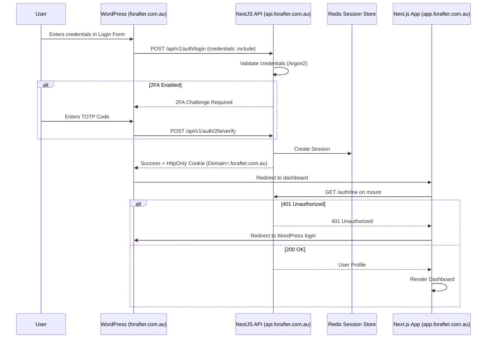

# 🔑 For After — Authentication

> How people sign in to For After: Customers with a password, Recipients and Trusted Contacts with a one-time email
> code. All three use server-side sessions in HttpOnly cookies; **JWTs in `localStorage` are explicitly rejected** to
> protect vault data against XSS.

| | |
|---|---|
| **Built** | Customer auth (Step 2), Recipient OTP (Step 13), Trusted Contact OTP (Step 14), deceased-account lockout (Step 15), **mandatory admin TOTP + recovery codes + admin idle timeout (Step 16)** |
| **Planned** | Optional Customer 2FA, email verification, password reset, session audit table, SMS OTP |
| **Related** | [Admin backend](admin.md) · [Authorization](authorization.md) · [Security](security.md) · [Recipient Portal](recipient-portal.md) · [Trusted Contact auth](trusted-contact-auth.md) |

## 🧭 Contents

1. [Three principals](#1-three-principals)
2. [Customer authentication (as built)](#2-customer-authentication-as-built)
3. [Customer authentication (planned)](#3-customer-authentication-planned)
4. [Recipient authentication (Step 13)](#4-recipient-authentication-step-13)
5. [Trusted Contact authentication (Step 14)](#5-trusted-contact-authentication-step-14)
6. [Shared OTP engine](#6-shared-otp-engine)
7. [Cookie behaviour](#7-cookie-behaviour)
8. [Environment variables](#8-environment-variables)
9. [Local development](#9-local-development)
10. [Forbidden anti-patterns](#10-forbidden-anti-patterns)

---

## 1. Three principals

| | Customer | Recipient | Trusted Contact |
|---|---|---|---|
| **Who** | Account holder | "People I Love" who receive released content | Person nominated to report the Customer's death |
| **Is a `User`?** | ✅ Yes | ❌ No | ❌ No |
| **Signs in with** | email + password | 6-digit email code | 6-digit email code |
| **Endpoints** | `/auth/*` | `/recipient-auth/*` | `/trusted-contact-auth/*` |
| **Cookie** | `for_after_session` | `for_after_recipient_session` | `for_after_trusted_contact_session` |
| **Session** | `express-session` in Redis | own opaque Redis session | own opaque Redis session |
| **Guard** | `SessionAuthGuard` (+ `CustomerGuard`) | `RecipientSessionAuthGuard` | `TrustedContactSessionAuthGuard` |
| **Request field** | `req.user` | `req.recipient` | `req.trustedContact` |

> 🔒 Each guard reads **only its own cookie**. A session of one type gets `401` on every other type's routes; this is
> tested in both directions for all three.

---

## 2. Customer authentication (as built)

### Endpoints

Prefix `/api/v1`: `POST /auth/register`, `POST /auth/login`, `GET /auth/me`, `POST /auth/logout`, and (Step 22)
`POST /auth/change-password` + `PATCH /users/me` (name only; email is read-only until a verified email-change flow
exists). Health checks stay unprefixed: `GET /health/database`, `GET /health/redis`.

### Passwords

- **Argon2id** with the `argon2` library defaults (64 MiB memory, 3 passes). Plaintext passwords are never stored or logged.
- Registration requires **12 to 128 characters**, no composition rules (NIST SP 800-63B). Registration does not log the user in.
- Login returns a generic error with the same timing for an unknown email.
- **Change password (Step 22):** signed-in, `ACTIVE` Customers only. Requires the current password (re-authentication);
  the new one follows the registration rule (one shared `IsNewPassword` decorator) and must differ from the current one.
  A wrong current password is `400`, not `401` (in this API `401` means "your session ended"). 5 per minute per IP.
  The hash, `User.passwordChangedAt` and a `PASSWORD_CHANGED` audit row (actor `CUSTOMER`, no metadata) commit in one
  transaction.

### Sessions

- `express-session` + `connect-redis`, cookie `for_after_session`, Redis key prefix `for_after:sess:`.
- The session holds only `userId` and `role`. `SessionAuthGuard` reloads the user from PostgreSQL on every request, so
  a status change takes effect immediately.
- The session id is regenerated on login (fixation); logout destroys it and clears the cookie.
- Every new session stores `authenticatedAt` (epoch ms). `SessionAuthGuard` refuses (`401`) and destroys any session
  whose `authenticatedAt` is older than the user's `passwordChangedAt`; sessions from before Step 22 have none and count
  as older. **After a password change** the browser that made it gets a new session id and stays signed in; every
  other session of that Customer ends on its next request. Recipient and Trusted Contact sessions are separate stores
  and are not affected. There is no per-user session list, so a standalone "sign out all devices" is still open.
- **No MemoryStore fallback:** the app refuses to start if `REDIS_URL` or `SESSION_SECRET` is missing, or Redis is
  unreachable at boot.

### Account status

Only `ACTIVE` may sign in. `SUSPENDED`, `DELETED` and `PASSED` get `403 This account cannot sign in.`, and only after a
correct password.

**Verified death (Step 15).** When an admin verifies a death case, the same transaction sets the account holder to
`PASSED`. New logins get the generic `403` above (nothing reveals a death verification), and **existing sessions stop
working immediately**: `SessionAuthGuard` re-reads the user on every request and refuses non-`ACTIVE` accounts (`401`).
Before verification the Customer is not blocked, so they can sign in and confirm they are alive
([death-verification.md](death-verification.md)).

> ⚠️ **Whether a `PASSED` account may ever sign in again** (e.g. after a wrong verification) is an open business
> decision; it is deny-by-default until decided.

### Admins (Step 16: mandatory TOTP)

Admins are `User` rows with role `ADMIN` or `SUPER_ADMIN`; there is **no admin sign-up** (an operator sets the role in
PostgreSQL). They start at the same `POST /auth/login`, but a correct admin password **never creates a session**: it
returns `{ mfaRequired: true, mfaSetupRequired, challengeId, expiresInSeconds }` backed by a 5-minute Redis challenge.
The session (its own cookie `for_after_admin_session` and Redis prefix `for_after:admin_sess:`, read only on
`/admin/*` and `/admin-auth/*`, with `adminMfaVerifiedAt` + `lastActivityAt`) is created only by
`POST /admin-auth/totp/confirm` (first enrollment), `/admin-auth/totp/verify` or `/admin-auth/recovery/verify`.
TOTP via `otplib` (±30 s window, replay-protected by time step), secrets AES-256-GCM encrypted with
`ADMIN_TOTP_ENCRYPTION_KEY`, 10 one-time recovery codes stored as hashes, 5 attempts per challenge, a Redis per-IP limit,
and a 30-minute admin idle timeout. Customer login and sessions are unchanged. Full design: [admin.md](admin.md).

### Rate limits

Register and login: 5 requests per minute per IP, counted in memory per instance (move to Redis when running more than
one instance).

---

## 3. Customer authentication (planned)

Not built yet. The target design:

### Login flow from WordPress to the app

### Planned features

| Feature | Design |
|---|---|
| **Email verification** | Single-use token; `POST /auth/verify-email`. Verification email sent via Postmark after registration. |
| **Password reset** | `POST /auth/forgot-password` generates an expiring token and emails it; `POST /auth/reset-password` validates it, re-hashes with Argon2 and **revokes all active sessions** for that user. |
| **Two-factor (TOTP)** | **Admins: built in Step 16** under `/admin-auth/totp/*` (see [admin.md](admin.md); no `qrcode` dependency, the `otpauthUri` is returned for the client to render). Optional Customer 2FA is still planned and could reuse the same service and tables. |
| **Session audit table** | PostgreSQL table: `id`, `user_id`, `session_token_hash`, `ip_address`, `user_agent`, `expires_at`, `last_used_at`, `revoked_at`, `created_at`. |

> ℹ️ Earlier drafts said "cost factor 12" for passwords: that is bcrypt terminology and does not apply to Argon2id.

---

## 4. Recipient authentication (Step 13)

Passwordless 6-digit email code for **Recipients** ("People I Love"). Full design: [recipient-portal.md](recipient-portal.md).

| | |
|---|---|
| **Flow** | `POST /recipient-auth/request-otp` → `POST /recipient-auth/verify-otp` → `for_after_recipient_session` |
| **Eligible email** | has a `RecipientMessageAccessGrant` for a `RELEASED`, non-deleted Message |
| **Channel** | email only; SMS is deferred, so mobile-only Recipients cannot sign in yet |
| **Delivery** | `RECIPIENT_OTP_DELIVERY_MODE`: `disabled` (default) or `console` (`NODE_ENV=development` only); no email provider yet |
| **Authorization** | the session holds only the verified email; access is decided per request from the release-time grant snapshot, never from a recipient id or the live `Recipient.email` |

---

## 5. Trusted Contact authentication (Step 14)

Passwordless 6-digit email code for **Trusted Contacts**. Full design: [trusted-contact-auth.md](trusted-contact-auth.md).

| | |
|---|---|
| **Flow** | `POST /trusted-contact-auth/request-otp` → `POST /trusted-contact-auth/verify-otp` → `for_after_trusted_contact_session` |
| **Eligible email** | any **active** `TrustedContact` (not deleted, Customer not deleted); no death report or released content needed |
| **Other routes** | `GET /trusted-contact-auth/me`, `POST /trusted-contact-auth/logout` (`204`) |
| **Delivery** | `TRUSTED_CONTACT_OTP_DELIVERY_MODE`: `disabled` (default) or `console` (`NODE_ENV=development` only) |
| **What it unlocks** | the accounts list, filing a death report and the case status ([death-verification.md](death-verification.md)); **never** any Customer content |

---

## 6. Shared OTP engine

Recipient and Trusted Contact sign-in share one implementation (`src/otp-auth/otp-auth.service.ts`) and differ only in
configuration:

| Behaviour | Detail |
|---|---|
| **Code** | 6 digits from `crypto.randomInt`; challenge id is 32 random bytes (`crypto.randomBytes`) |
| **Storage** | Redis hash with a TTL (default 10 min); only `HMAC-SHA256(pepper, "challengeId:code")` is stored, never the code |
| **Verify** | attempt counted atomically before a constant-time compare; max 5 attempts; single use; eligibility re-checked |
| **Errors** | `request-otp` always returns the same `202` (anti-enumeration); every verify failure is the same `401` |
| **Rate limits** | per email and per IP, counted in Redis (shared by all instances) → `429` |
| **Session** | opaque 32-byte id, stored under `sha256(id)` with a 7-day TTL; it is **not** `express-session` and never sets `req.user` |
| **Separation** | each principal has its own pepper, Redis namespace (`for_after:recipient_*` / `for_after:trusted_contact_*`), cookie and guard, so one principal's code or session never works for the other |

---

## 7. Cookie behaviour

All three cookies are `HttpOnly`, `SameSite=Lax`, `Path=/`, and `Secure` in production.

| | Localhost | Production |
|---|---|---|
| Cookie domain (`COOKIE_DOMAIN`, `RECIPIENT_COOKIE_DOMAIN`, `TRUSTED_CONTACT_COOKIE_DOMAIN`) | empty (host-only cookie) | `.forafter.com.au` |
| `Secure` | off (`NODE_ENV=development`) | on (`NODE_ENV=production`) |
| `SameSite` / `HttpOnly` | `Lax` / on | `Lax` / on |
| Trust proxy | off | 1 hop (AWS load balancer terminates TLS) |

Locally, `localhost:3000` (Next.js) and `localhost:4000` (API) are the same site, so the `Lax` cookie is sent on
`fetch(..., { credentials: 'include' })`. In production, `forafter.com.au`, `app.forafter.com.au` and
`api.forafter.com.au` share the `.forafter.com.au` cookie, so a login on the WordPress page is visible to the Next.js
dashboard's `GET /auth/me`.

---

## 8. Environment variables

| Variable | Required | Example / notes |
|---|:--:|---|
| `DATABASE_URL` | ✅ | PostgreSQL connection string |
| `REDIS_URL` | ✅ | `redis://localhost:6379` (`rediss://` for TLS in production) |
| `SESSION_SECRET` | ✅ | 32+ random characters, different per environment |
| `SESSION_TTL_SECONDS` | no | default `604800` (7 days) |
| `COOKIE_DOMAIN` | prod | `.forafter.com.au`; leave empty locally |
| `FRONTEND_URL` | for CORS | `http://localhost:3000` / `https://app.forafter.com.au` |
| `WORDPRESS_URL` | for CORS | comma-separated: `https://forafter.com.au,https://www.forafter.com.au` |
| `NODE_ENV` | ✅ | `development` / `production` (controls `Secure` cookies, trust proxy and console OTP delivery) |
| `RECIPIENT_OTP_PEPPER` | ✅ | 32+ random characters (Step 13); the app will not start without it |
| `RECIPIENT_*` | no | Recipient OTP, rate-limit, session and cookie settings ([recipient-portal.md](recipient-portal.md)) |
| `TRUSTED_CONTACT_OTP_PEPPER` | ✅ | 32+ random characters, different from the Recipient pepper (Step 14) |
| `TRUSTED_CONTACT_*` | no | Trusted Contact OTP, rate-limit, session and cookie settings ([trusted-contact-auth.md](trusted-contact-auth.md)) |

---

## 9. Local development

- The Next.js app (`for-after-frontend`, Step 17) has `/login`, `/register` and a development-only `/dev-login` at
  `http://localhost:3000`. `/dev-login` exists only when `NEXT_PUBLIC_APP_ENV=development` and the app is not a
  production build (a production build answers `404`). It calls the real `POST /auth/login`. No separate
  `/dev-register` was needed: `/register` is the normal Customer sign-up page.
- The frontend reads auth state only from `GET /auth/me` with `credentials: 'include'`; see the frontend README.
- Postman or curl against `http://localhost:4000/api/v1` still work.
- For OTP testing, set `RECIPIENT_OTP_DELIVERY_MODE=console` and/or `TRUSTED_CONTACT_OTP_DELIVERY_MODE=console` with
  `NODE_ENV=development`: the code appears in the API terminal as `[DEV ONLY] ... OTP for s***@example.com: 123456`.

---

## 10. Forbidden anti-patterns

- ❌ **No** JWTs in `localStorage` or `sessionStorage`.
- ❌ **No** tokens in URL query parameters.
- ❌ **No** reliance on the WordPress `wp_users` table for application authentication. All application auth is handled
  natively by NestJS.
- ❌ **No** password or `User` row for Recipients or Trusted Contacts.
- ❌ **No** console OTP delivery outside `NODE_ENV=development` (startup fails).
