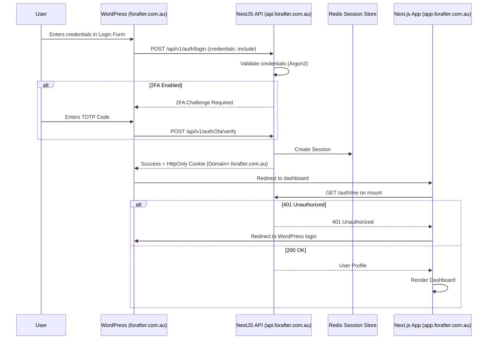

# 🔑 For After — Authentication

> How people sign in to For After: Customers with a password, Recipients and Trusted Contacts with a one-time email
> code. All three use server-side sessions in HttpOnly cookies; **JWTs in `localStorage` are explicitly rejected** to
> protect vault data against XSS.

| | |
|---|---|
| **Built** | Customer auth (Step 2), Recipient OTP (Step 13), Trusted Contact OTP (Step 14), deceased-account lockout (Step 15), **mandatory admin TOTP + recovery codes + admin idle timeout (Step 16)**, change password (Step 22), **email verification, password reset and Redis-backed rate limits (Phase 04)** |
| **Planned** | Optional Customer 2FA, session audit table, SMS OTP |
| **Related** | [Admin backend](admin.md) · [Authorization](authorization.md) · [Security](security.md) · [Recipient Portal](recipient-portal.md) · [Trusted Contact auth](trusted-contact-auth.md) |

## 🧭 Contents

1. [Three principals](#1-three-principals)
2. [Customer authentication (as built)](#2-customer-authentication-as-built)
3. [Customer authentication (planned)](#3-customer-authentication-planned)
4. [Recipient authentication (Step 13)](#4-recipient-authentication-step-13)
5. [Trusted Contact authentication (Step 14)](#5-trusted-contact-authentication-step-14)
6. [Shared OTP engine](#6-shared-otp-engine)
7. [Cookie behaviour](#7-cookie-behaviour)
8. [Environment variables](#8-environment-variables)
9. [Local development](#9-local-development)
10. [Forbidden anti-patterns](#10-forbidden-anti-patterns)

---

## 1. Three principals

| | Customer | Recipient | Trusted Contact |
|---|---|---|---|
| **Who** | Account holder | "People I Love" who receive released content | Person nominated to report the Customer's death |
| **Is a `User`?** | ✅ Yes | ❌ No | ❌ No |
| **Signs in with** | email + password | 6-digit email code | 6-digit email code |
| **Endpoints** | `/auth/*` | `/recipient-auth/*` | `/trusted-contact-auth/*` |
| **Cookie** | `for_after_session` | `for_after_recipient_session` | `for_after_trusted_contact_session` |
| **Session** | `express-session` in Redis | own opaque Redis session | own opaque Redis session |
| **Guard** | `SessionAuthGuard` (+ `CustomerGuard`) | `RecipientSessionAuthGuard` | `TrustedContactSessionAuthGuard` |
| **Request field** | `req.user` | `req.recipient` | `req.trustedContact` |

> 🔒 Each guard reads **only its own cookie**. A session of one type gets `401` on every other type's routes; this is
> tested in both directions for all three.

---

## 2. Customer authentication (as built)

### Endpoints

Prefix `/api/v1`: `POST /auth/register`, `POST /auth/login`, `GET /auth/me`, `POST /auth/logout`, and (Step 22)
`POST /auth/change-password` + `PATCH /users/me` (name only; the email changes only through the Phase 08 flow), and (Phase 04) `POST /auth/verify-email`, `POST /auth/resend-verification`, `POST /auth/forgot-password`,
`POST /auth/reset-password`. Health checks stay unprefixed: `GET /health/database`, `GET /health/redis`.

### Email verification and password reset (Phase 04)

Both use a single-use emailed link carrying a 32-byte random token (base64url, 43 characters). Only its SHA-256 is
stored (`AuthToken`, `purpose` `EMAIL_VERIFICATION` | `PASSWORD_RESET`, unique `tokenHash`); the raw token exists only
in the email and is never logged. A token is consumed by one conditional update (`consumedAt` null and not expired),
so concurrent uses succeed exactly once. Issuing a new token supersedes the account's older unused one, under a row
lock on the user. Each account gets at most **3 emails per hour** per purpose (counted from the token rows), on top of
the per-IP limits below. Links are sent straight through `EmailProvider`, like sign-in codes: a queued job would keep
the raw token in Redis job data and failed-job history ([email-production-setup.md](email-production-setup.md)).

| | Email verification | Password reset |
|---|---|---|
| Sent | after `POST /auth/register` (in the background), and by `POST /auth/resend-verification` for an ACTIVE, unverified account | by `POST /auth/forgot-password` for an ACTIVE Customer (admins recover through operations) |
| Link | `APP_BASE_URL/verify-email?token=…` | `APP_BASE_URL/reset-password?token=…` |
| Lifetime | `EMAIL_VERIFICATION_TOKEN_TTL_SECONDS`, default 86400 (24 h) | `PASSWORD_RESET_TOKEN_TTL_SECONDS`, default 3600 (60 min) |
| Request answer | resend: `202`, the same message for any email | `202` `"If an account exists for that email, password reset instructions have been sent."` for any email |
| Use | `POST /auth/verify-email {token}` → `200 {verified: true}`; sets `emailVerifiedAt` (kept if already set); audited `EMAIL_VERIFIED` | `POST /auth/reset-password {token, newPassword}` → `200 {success: true}`; registration password rule, Argon2id, `passwordChangedAt` (every existing session gets `401`), other reset links consumed, audited `PASSWORD_RESET_COMPLETED`. **No session is created**: the Customer signs in again |
| Bad link | `400 "This link is invalid or has expired."` (wrong, expired, used or superseded alike) | same |

The request endpoints never await the lookup or the send, so neither the answer nor its timing reveals whether an
account exists. **Login policy:** no product document says an unverified Customer may not sign in, so login is
unchanged; `emailVerifiedAt` is returned by `GET /auth/me` for a future decision (open product question).

### Passwords

- **Argon2id** with the `argon2` library defaults (64 MiB memory, 3 passes). Plaintext passwords are never stored or logged.
- Registration requires **12 to 128 characters**, no composition rules (NIST SP 800-63B). Registration does not log the user in.
- Login returns a generic error with the same timing for an unknown email.
- **Change password (Step 22):** signed-in, `ACTIVE` Customers only. Requires the current password (re-authentication);
  the new one follows the registration rule (one shared `IsNewPassword` decorator) and must differ from the current one.
  A wrong current password is `400`, not `401` (in this API `401` means "your session ended"). 5 per minute per IP.
  The hash, `User.passwordChangedAt` and a `PASSWORD_CHANGED` audit row (actor `CUSTOMER`, no metadata) commit in one
  transaction.

### Sessions

- `express-session` + `connect-redis`, cookie `for_after_session`, Redis key prefix `for_after:sess:`.
- The session holds only `userId` and `role`. `SessionAuthGuard` reloads the user from PostgreSQL on every request, so
  a status change takes effect immediately.
- The session id is regenerated on login (fixation); logout destroys it and clears the cookie.
- Every new session stores `authenticatedAt` (epoch ms). `SessionAuthGuard` refuses (`401`) and destroys any session
  whose `authenticatedAt` is older than the user's `passwordChangedAt`; sessions from before Step 22 have none and count
  as older. **After a password change** the browser that made it gets a new session id and stays signed in; every
  other session of that Customer ends on its next request. Recipient and Trusted Contact sessions are separate stores
  and are not affected. There is no per-user session list, so a standalone "sign out all devices" is still open.
- **No MemoryStore fallback:** the app refuses to start if `REDIS_URL` or `SESSION_SECRET` is missing, or Redis is
  unreachable at boot.

### Account status

Only `ACTIVE` may sign in. `SUSPENDED`, `DELETED` and `PASSED` get `403 This account cannot sign in.`, and only after a
correct password.

**Verified death (Step 15).** When an admin verifies a death case, the same transaction sets the account holder to
`PASSED`. New logins get the generic `403` above (nothing reveals a death verification), and **existing sessions stop
working immediately**: `SessionAuthGuard` re-reads the user on every request and refuses non-`ACTIVE` accounts (`401`).
Before verification the Customer is not blocked, so they can sign in and confirm they are alive
([death-verification.md](death-verification.md)).

> ⚠️ **Whether a `PASSED` account may ever sign in again** (e.g. after a wrong verification) is an open business
> decision; it is deny-by-default until decided.

### Admins (Step 16: mandatory TOTP)

Admins are `User` rows with role `ADMIN` or `SUPER_ADMIN`; there is **no admin sign-up** (an operator sets the role in
PostgreSQL). They start at the same `POST /auth/login`, but a correct admin password **never creates a session**: it
returns `{ mfaRequired: true, mfaSetupRequired, challengeId, expiresInSeconds }` backed by a 5-minute Redis challenge.
The session (its own cookie `for_after_admin_session` and Redis prefix `for_after:admin_sess:`, read only on
`/admin/*` and `/admin-auth/*`, with `adminMfaVerifiedAt` + `lastActivityAt`) is created only by
`POST /admin-auth/totp/confirm` (first enrollment), `/admin-auth/totp/verify` or `/admin-auth/recovery/verify`.
TOTP via `otplib` (±30 s window, replay-protected by time step), secrets AES-256-GCM encrypted with
`ADMIN_TOTP_ENCRYPTION_KEY`, 10 one-time recovery codes stored as hashes, 5 attempts per challenge, a Redis per-IP limit,
and a 30-minute admin idle timeout. Customer login and sessions are unchanged. Full design: [admin.md](admin.md).

### Change email (Phase 08)

`User.email` never changes on request. The Customer asks, the new address proves itself, then the account switches:

1. `POST /auth/change-email {newEmail, currentPassword}` (Customer session, `CustomerGuard`; admins `403`, Recipient and
   Trusted Contact `401`). The current password is checked with the same Argon2id check as change-password (wrong:
   `400 "Your current password is incorrect."`), before anything about the new address is looked at. The address is
   normalized like registration; the current one is `400`, one another account uses is `409` (registration's
   message). Answer `202 {pendingEmail: "n***@example.com"}`.
2. A single-use link goes to the **new** address only: `APP_BASE_URL/settings/verify-email-change?token=…`. It is an
   `AuthToken` with purpose `EMAIL_CHANGE` carrying `newEmail` (same rules as the other links: SHA-256 at rest, 24 h via
   `EMAIL_VERIFICATION_TOKEN_TTL_SECONDS`, a newer request or `POST /auth/change-email/resend` supersedes it,
   `POST /auth/change-email/cancel` ends it, at most 3 per account per hour). Audited `EMAIL_CHANGE_REQUESTED`.
3. `POST /auth/change-email/confirm {token}` is public, like `verify-email`: the token authorizes this one change and
   nothing else. In one transaction: the token is consumed (once, however many race), `email` = the new address,
   `emailVerifiedAt` = now (the link proves the inbox), `emailChangedAt` = now, the account's other change **and
   password-reset** links are consumed (a reset link left in the old inbox cannot reopen the account), audited
   `EMAIL_CHANGED` (no addresses in audit rows). If another account took the address meanwhile, the unique index
   decides: `409`, and nothing (token included) changes.
4. `SessionAuthGuard` refuses every Customer session signed in before `emailChangedAt` (as for `passwordChangedAt`;
   one column each, so neither carries the other's meaning). Nobody is signed in by the link: the Customer signs in
   with the new address; the old one no longer works. Recipient and Trusted Contact sessions are separate and
   unaffected.
5. The old address gets "Your For After email address was changed" (no link, no token, not the new address), after
   the change commits. Best effort, like other auth emails: a failure is logged (`email-changed_failed`) and never
   undoes the change; there is no durable retry for it (only release notifications have a queue).

### Rate limits

Per IP, counted in Redis (Phase 04, `RedisThrottlerStorage` on the app's Redis client, keys under
`for_after:throttle:` + the throttler's SHA-256 of route and IP), so every API instance enforces the same counter:

| Route | Limit |
|---|---|
| `POST /auth/register`, `/auth/login` (Customers and admins), `/auth/change-password`, `/auth/reset-password`, `/auth/change-email` | 5 per minute |
| `POST /auth/verify-email`, `/auth/change-email/confirm` | 10 per minute |
| `POST /auth/forgot-password`, `/auth/resend-verification`, `/auth/change-email/resend` | 10 per hour (plus 3 emails per account per hour) |

Recipient and Trusted Contact OTP and admin MFA keep their own Redis counters (unchanged). If Redis is unavailable the
request fails (`500`) rather than going through unthrottled; sessions need Redis anyway. Fixed window: a caller over
the limit stays blocked until the window ends.

---

## 3. Customer authentication (planned)

Not built yet. The target design:

### Login flow from WordPress to the app

### Planned features

| Feature | Design |
|---|---|
| **Two-factor (TOTP)** | **Admins: built in Step 16** under `/admin-auth/totp/*` (see [admin.md](admin.md); no `qrcode` dependency, the `otpauthUri` is returned for the client to render). Optional Customer 2FA is still planned and could reuse the same service and tables. |
| **Session audit table** | PostgreSQL table: `id`, `user_id`, `session_token_hash`, `ip_address`, `user_agent`, `expires_at`, `last_used_at`, `revoked_at`, `created_at`. |

> ℹ️ Earlier drafts said "cost factor 12" for passwords: that is bcrypt terminology and does not apply to Argon2id.

---

## 4. Recipient authentication (Step 13)

Passwordless 6-digit email code for **Recipients** ("People I Love"). Full design: [recipient-portal.md](recipient-portal.md).

| | |
|---|---|
| **Flow** | `POST /recipient-auth/request-otp` → `POST /recipient-auth/verify-otp` → `for_after_recipient_session` |
| **Eligible email** | has a `RecipientMessageAccessGrant` for a `RELEASED`, non-deleted Message |
| **Channel** | email only; SMS is deferred, so mobile-only Recipients cannot sign in yet |
| **Delivery** | email through `EMAIL_PROVIDER` (Step 24, Brevo; [email setup](email-production-setup.md)); sent directly, never queued, so the plaintext code never sits in Redis |
| **Authorization** | the session holds only the verified email; access is decided per request from the release-time grant snapshot, never from a recipient id or the live `Recipient.email` |

---

## 5. Trusted Contact authentication (Step 14)

Passwordless 6-digit email code for **Trusted Contacts**. Full design: [trusted-contact-auth.md](trusted-contact-auth.md).

| | |
|---|---|
| **Flow** | `POST /trusted-contact-auth/request-otp` → `POST /trusted-contact-auth/verify-otp` → `for_after_trusted_contact_session` |
| **Eligible email** | any **active** `TrustedContact` (not deleted, Customer not deleted); no death report or released content needed |
| **Other routes** | `GET /trusted-contact-auth/me`, `POST /trusted-contact-auth/logout` (`204`) |
| **Delivery** | email through `EMAIL_PROVIDER` (Step 24), same as Recipients |
| **What it unlocks** | the accounts list, filing a death report and the case status ([death-verification.md](death-verification.md)); **never** any Customer content |

---

## 6. Shared OTP engine

Recipient and Trusted Contact sign-in share one implementation (`src/otp-auth/otp-auth.service.ts`) and differ only in
configuration:

| Behaviour | Detail |
|---|---|
| **Code** | 6 digits from `crypto.randomInt`; challenge id is 32 random bytes (`crypto.randomBytes`) |
| **Storage** | Redis hash with a TTL (default 10 min); only `HMAC-SHA256(pepper, "challengeId:code")` is stored, never the code |
| **Verify** | attempt counted atomically before a constant-time compare; max 5 attempts; single use; eligibility re-checked |
| **Errors** | `request-otp` always returns the same `202` (anti-enumeration); every verify failure is the same `401` |
| **Rate limits** | per email and per IP, counted in Redis (shared by all instances) → `429` |
| **Session** | opaque 32-byte id, stored under `sha256(id)` with a 7-day TTL; it is **not** `express-session` and never sets `req.user` |
| **Separation** | each principal has its own pepper, Redis namespace (`for_after:recipient_*` / `for_after:trusted_contact_*`), cookie and guard, so one principal's code or session never works for the other |

---

## 7. Cookie behaviour

All three cookies are `HttpOnly`, `SameSite=Lax`, `Path=/`, and `Secure` in production.

| | Localhost | Production |
|---|---|---|
| Cookie domain (`COOKIE_DOMAIN`, `RECIPIENT_COOKIE_DOMAIN`, `TRUSTED_CONTACT_COOKIE_DOMAIN`) | empty (host-only cookie) | `.forafter.com.au` |
| `Secure` | off (`NODE_ENV=development`) | on (`NODE_ENV=production`) |
| `SameSite` / `HttpOnly` | `Lax` / on | `Lax` / on |
| Trust proxy | off | 1 hop (AWS load balancer terminates TLS) |

Locally, `localhost:3000` (Next.js) and `localhost:4000` (API) are the same site, so the `Lax` cookie is sent on
`fetch(..., { credentials: 'include' })`. In production, `forafter.com.au`, `app.forafter.com.au` and
`api.forafter.com.au` share the `.forafter.com.au` cookie, so a login on the WordPress page is visible to the Next.js
dashboard's `GET /auth/me`.

---

## 8. Environment variables

| Variable | Required | Example / notes |
|---|:--:|---|
| `DATABASE_URL` | ✅ | PostgreSQL connection string |
| `REDIS_URL` | ✅ | `redis://localhost:6379` (`rediss://` for TLS in production) |
| `SESSION_SECRET` | ✅ | 32+ random characters, different per environment |
| `SESSION_TTL_SECONDS` | no | default `604800` (7 days) |
| `COOKIE_DOMAIN` | prod | `.forafter.com.au`; leave empty locally |
| `FRONTEND_URL` | for CORS | `http://localhost:3000` / `https://app.forafter.com.au` |
| `WORDPRESS_URL` | for CORS | comma-separated: `https://forafter.com.au,https://www.forafter.com.au` |
| `NODE_ENV` | ✅ | `development` / `production` (controls `Secure` cookies, trust proxy and console OTP delivery) |
| `RECIPIENT_OTP_PEPPER` | ✅ | 32+ random characters (Step 13); the app will not start without it |
| `RECIPIENT_*` | no | Recipient OTP, rate-limit, session and cookie settings ([recipient-portal.md](recipient-portal.md)) |
| `TRUSTED_CONTACT_OTP_PEPPER` | ✅ | 32+ random characters, different from the Recipient pepper (Step 14) |
| `TRUSTED_CONTACT_*` | no | Trusted Contact OTP, rate-limit, session and cookie settings ([trusted-contact-auth.md](trusted-contact-auth.md)) |
| `EMAIL_VERIFICATION_TOKEN_TTL_SECONDS` | no | default `86400` (Phase 04) |
| `PASSWORD_RESET_TOKEN_TTL_SECONDS` | no | default `3600` (Phase 04) |
| `THROTTLE_KEY_PREFIX` | no | Redis namespace for rate-limit counters, default `for_after:throttle:`; e2e tests set one per test file |

---

## 9. Local development

- The Next.js app (`for-after-frontend`, Step 17) has `/login`, `/register` and a development-only `/dev-login` at
  `http://localhost:3000`. `/dev-login` exists only when `NEXT_PUBLIC_APP_ENV=development` and the app is not a
  production build (a production build answers `404`). It calls the real `POST /auth/login`. No separate
  `/dev-register` was needed: `/register` is the normal Customer sign-up page.
- The frontend reads auth state only from `GET /auth/me` with `credentials: 'include'`; see the frontend README.
- Postman or curl against `http://localhost:4000/api/v1` still work.
- For OTP testing, set `EMAIL_PROVIDER=console` with `NODE_ENV=development`: every email appears in the API terminal
  as `[DEV ONLY] Email (recipient-otp) to s***@example.com | Your For After sign-in code | … Your sign-in code is 123456 …`.
  With `EMAIL_PROVIDER=brevo` the code arrives in the inbox instead (only for an eligible email); see
  [email setup](email-production-setup.md) for the `unauthorized` troubleshooting.

---

## 10. Forbidden anti-patterns

- ❌ **No** JWTs in `localStorage` or `sessionStorage`.
- ❌ **No** tokens in URL query parameters.
- ❌ **No** reliance on the WordPress `wp_users` table for application authentication. All application auth is handled
  natively by NestJS.
- ❌ **No** password or `User` row for Recipients or Trusted Contacts.
- ❌ **No** console OTP delivery outside `NODE_ENV=development` (startup fails).
