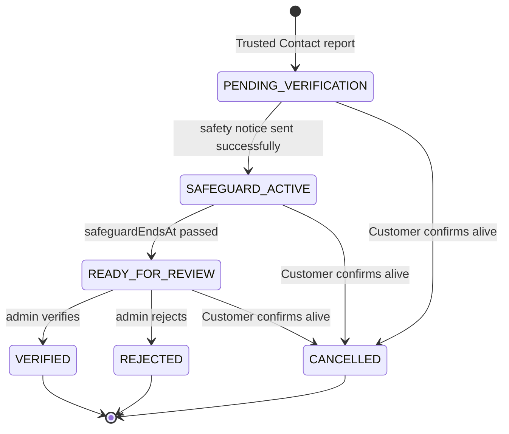

# ⚖️ For After — Death Verification Workflow

> From a Trusted Contact's report to the release of death-triggered Messages. Human-in-the-loop by design: a report is
> never proof, a safeguard window protects the account holder, and only an explicit admin decision verifies a death.

| | |
|---|---|
| **Built** | Report intake (Step 14) · safety notice, safeguard window, confirm-alive, admin verify/reject, death-trigger activation and release (Step 15) |
| **Frontend** | Step 19 (`for-after-frontend`): Trusted Contact report form and status page; Customer safety banner with "I'm still alive" (confirm-alive) on every dashboard page. Admin review UI is not built |
| **Not built** | Evidence upload, second-contact confirmation, production email provider, reopening a closed case, admin review UI |
| **Related** | [Trusted Contact auth](trusted-contact-auth.md) · [Scheduling](scheduling.md) · [Message release](message-release.md) · [Threat model](../threat-model.md) |

> ⚠️ **REPORT ≠ VERIFICATION ≠ RELEASE.** A Trusted Contact report never marks anyone dead. Two reports never verify
> anything. An elapsed safeguard never verifies anything. Only an authorized admin's explicit decision does, and even
> then each Message is released only after every Step 12 release check passes.

## 🧭 Contents

1. [Lifecycle](#1-lifecycle)
2. [Report intake (Step 14)](#2-report-intake-step-14)
3. [Safety notice and safeguard window](#3-safety-notice-and-safeguard-window)
4. [Customer: confirm alive](#4-customer-confirm-alive)
5. [Admin decision](#5-admin-decision)
6. [Death-trigger activation and release](#6-death-trigger-activation-and-release)
7. [Account holder after VERIFIED](#7-account-holder-after-verified)
8. [Queue, reconciliation and failure handling](#8-queue-reconciliation-and-failure-handling)
9. [Data model](#9-data-model)
10. [Audit trail and logging](#10-audit-trail-and-logging)
11. [Who sees what](#11-who-sees-what)
12. [Configuration](#12-configuration)
13. [Testing](#13-testing)
14. [Not built / open decisions](#14-not-built--open-decisions)
15. [Original plan and terminology](#15-original-plan-and-terminology)

---

## 1. Lifecycle



```text
REPORT → SAFETY NOTICE → SAFEGUARD → READY_FOR_REVIEW → ADMIN VERIFIED → DEATH TRIGGER ACTIVATION → MESSAGE RELEASE
```

| Status | Meaning | Who moves it on |
|---|---|---|
| `PENDING_VERIFICATION` | Report(s) received; safety notice not yet sent | System, once the notice is sent |
| `SAFEGUARD_ACTIVE` | Notice sent; waiting until `safeguardEndsAt` | System (safeguard job / reconciler) |
| `READY_FOR_REVIEW` | Safeguard over; awaiting a human decision | Admin, or the Customer |
| `VERIFIED` ⛔ | Death approved by an admin; death triggers activate | Terminal |
| `REJECTED` ⛔ | Admin could not verify | Terminal |
| `CANCELLED` ⛔ | Customer confirmed they are alive | Terminal |

Terminal cases never move to another terminal state through any API (e.g. no `VERIFIED → CANCELLED`, no
`REJECTED → VERIFIED`). Recovery from a wrong decision is a future, separately designed workflow.

---

## 2. Report intake (Step 14)

`POST /api/v1/trusted-contact/accounts/:trustedContactId/death-reports` (Trusted Contact session):

```json
{ "reportedDateOfDeath": "2026-09-28", "note": "Fictional test report.", "confirmReport": true }
```

- One `DeathVerificationCase` per Customer (`ownerUserId` unique); each Trusted Contact files at most one `DeathReport`
  per case (`409 A report has already been submitted for this account.`).
- Reports are accepted while the case is **open** (`PENDING_VERIFICATION`, `SAFEGUARD_ACTIVE`, `READY_FOR_REVIEW`):
  a second contact's report is supporting information for the admin. A closed case refuses reports (`409`).
- `reportedDateOfDeath` is reporter-provided information only (date-only, not in the future). It is **never** used as
  the verified time of death.
- `confirmReport: true` is a deliberate-action safeguard, not a legal attestation. `note` ≤ 2000 chars, never logged.
- Reporter details are snapshotted (`reporterFirstNameSnapshot`, …), so later contact edits never change a report.
- `201 {caseId, reportId, status, reportedAt, message}`; the first report then triggers the safety notice (§3).

---

## 3. Safety notice and safeguard window

```text
report → PENDING_VERIFICATION → send safety notice → success?
                                        ├─ yes → SAFEGUARD_ACTIVE (safetyNoticeSentAt, safeguardStartedAt, safeguardEndsAt)
                                        └─ no  → stays PENDING_VERIFICATION; retried by the reconciler
```

- **The countdown starts only after a successful send.** `safeguardEndsAt = sentAt + DEATH_VERIFICATION_SAFEGUARD_SECONDS`
  (default 1,209,600 s = 14 days) is **stored on the case**, so a later config change never moves a running window.
- **Notice content** (provider-neutral `DeathNoticeDelivery.sendAccountHolderSafetyNotice({caseId, email, displayName,
  safeguardEndsAt})`): "A death report has been submitted regarding your For After account. If you are able to access
  your account, please sign in and confirm that you are alive before the safeguard period ends." Never the reporter,
  their note, Message titles/content, recipients, Memory Vault, My Story or My Wishes.
- **Delivery modes** (`DEATH_VERIFICATION_NOTICE_DELIVERY_MODE`):
  - `disabled` (default): the send **fails**, so no safeguard can start. Safe until the Step 17 email provider exists.
  - `console`: logs `[DEV ONLY] Death verification safety notice sent to l***@example.com for case <caseId>`.
    **`NODE_ENV=development` only**; any other `NODE_ENV` stops startup with a clear error.
- **Failure:** the case stays `PENDING_VERIFICATION`, `safetyNoticeAttemptCount` / `safetyNoticeLastAttemptAt` record
  the attempt (no provider error text is stored), the report is kept, and the reconciler retries each interval. Each
  attempt is claimed atomically, so two instances never send at once.
- **Step 14 cases** (`PENDING_VERIFICATION`, ≥ 1 report, `safetyNoticeSentAt = null`) are picked up by the reconciler
  automatically; no data needs deleting.
- **When the window ends:** `SAFEGUARD_ACTIVE → READY_FOR_REVIEW`, only if the case is still `SAFEGUARD_ACTIVE`, the
  notice was sent and `safeguardEndsAt ≤ now` (re-read from PostgreSQL). Never `VERIFIED`; nothing is released.

---

## 4. Customer: confirm alive

Customer session (`SessionAuthGuard` + `CustomerGuard`):

| Endpoint | Result |
|---|---|
| `GET /api/v1/death-verification/me` | `{status, safeguardEndsAt, canConfirmAlive}`; `status: null` when there is no case |
| `POST /api/v1/death-verification/me/confirm-alive` `{"confirmAlive": true}` | open case → `200 CANCELLED` (`cancelledAt`, audit `CUSTOMER_CONFIRMED_ALIVE`) |

- Allowed while `PENDING_VERIFICATION`, `SAFEGUARD_ACTIVE` or `READY_FOR_REVIEW`. The Customer is **not** blocked before
  an actual verification: they can sign in, see the state and respond.
- `404` with no case; `409` if the case is already closed (`CANCELLED`, `REJECTED`, or `VERIFIED` in a race).
- Reports and history are kept. A stale safeguard job for the cancelled case is a no-op.
- The body accepts **only** `confirmAlive` (no free-text note in Step 15; unknown fields → `400`).
- The response never includes Trusted Contact identity, report notes, report count or admin notes.

---

## 5. Admin decision

Step 15 admin API, part of the Step 16 admin backend ([admin.md](admin.md)): admins must have completed TOTP. `SessionAuthGuard` + `AdminGuard`: **`ADMIN` and
`SUPER_ADMIN` only**. Customers get `403`; Recipient and Trusted Contact sessions get `401`. There is no way to register
as an admin: an operator sets `User.role`.

| Endpoint | Purpose |
|---|---|
| `GET /api/v1/admin/death-verifications[?status&page&limit]` | `{items, pagination}` (Step 16; `limit` ≤ 100, default 25), newest first: status, dates, report count, account holder (id, email, name) |
| `GET /api/v1/admin/death-verifications/:caseId` | Full review: timeline, account holder, every report (snapshots, date, **note**), audit trail, activations with Message status (no content). Each view writes `ADMIN_VIEWED_DEATH_CASE` to `AuditLog` (Step 16) |
| `POST /api/v1/admin/death-verifications/:caseId/verify` | `READY_FOR_REVIEW → VERIFIED` |
| `POST /api/v1/admin/death-verifications/:caseId/reject` | `READY_FOR_REVIEW → REJECTED` |

### Verify

```json
{ "verifiedDeathAt": "2026-09-28T14:30:00+10:00", "confirmVerification": true, "decisionNote": "Verified during manual review." }
```

- `verifiedDeathAt`: **required**, ISO 8601 with an explicit timezone, not in the future; stored as UTC. Supplied by
  the admin; never inferred from `reportedDateOfDeath` and never defaulted to midnight.
- `confirmVerification` must be `true`; `decisionNote` optional, ≤ 2000, admin-only, never logged.
- Requires `status = READY_FOR_REVIEW`, `safetyNoticeSentAt` set and `safeguardEndsAt ≤ now`. During
  `PENDING_VERIFICATION`/`SAFEGUARD_ACTIVE` → `409`. **There is no force/override.**
- One transaction sets `VERIFIED`, `verifiedAt = now`, `verifiedDeathAt`, `verifiedByUserId`, `adminDecisionNote`,
  `resolvedAt`, sets the account holder to `PASSED` (§7) and writes `ADMIN_VERIFIED`. Death triggers are activated
  after commit (§6).
- Already `VERIFIED`, `REJECTED` or `CANCELLED` → `409` (never a second activation).

### Reject

`{ "confirmRejection": true, "decisionNote": "Unable to verify." }` → `REJECTED` (`rejectedAt`, `rejectedByUserId`,
note, audit `ADMIN_REJECTED`). Only from `READY_FOR_REVIEW`. Nothing is activated or released; the Customer is untouched.

Both decisions also write a generic `AuditLog` row (`DEATH_VERIFICATION_VERIFIED` / `DEATH_VERIFICATION_REJECTED`, actor
admin, subject the case) in the same transaction (Step 16). `DeathVerificationAuditEvent` is unchanged.

### verifiedAt vs verifiedDeathAt

| Field | Meaning | Used for |
|---|---|---|
| `verifiedDeathAt` | the approved time of death (admin-supplied) | `AFTER_DEATH` due times |
| `verifiedAt` | when For After approved the verification | `ON_DEATH` due time |

### Races

Confirm-alive, verify and reject are each a single conditional `UPDATE … WHERE status = <expected>` inside a
transaction. PostgreSQL row locking guarantees exactly one wins; the others see zero rows updated and return `409`
(or `401` for a Customer whose account became `PASSED` first). Tested with concurrent requests.

---

## 6. Death-trigger activation and release

Only `DeathVerificationCase.status = VERIFIED` authorizes activation. A `DeathReport` or `reportedDateOfDeath` never does.

**`DeathTriggeredMessageActivation`** (one per Message, `messageId` unique) is the durable execution record.
`MessageSchedule` keeps its original meaning; `scheduledFor` stays `FIXED_DATE`-only.

| Trigger | `dueAt` | Example |
|---|---|---|
| `ON_DEATH` | `verifiedAt` (release as soon as verification succeeds, never at the historical time of death) | verified 2026-09-29T05:00Z → due then |
| `AFTER_DEATH` | `verifiedDeathAt + afterDeathDays` (UTC days) | died 2026-09-20T10:00Z, 30 days → 2026-10-20T10:00Z |
| `AFTER_DEATH`, 0 days | `verifiedDeathAt` | usually due immediately |
| `ANNUAL_AFTER_DEATH`, `BIRTHDAY`, `ANNIVERSARY`, `CUSTOM_EVENT` | not activated (deferred) | |

- **Activation** (after commit, and by the reconciler): for every `SCHEDULED`, non-deleted Message of the Customer with an
  `ON_DEATH`/`AFTER_DEATH` schedule and no activation yet → one row (`createMany … skipDuplicates`), under a row lock on
  the case. Sets `deathTriggersActivatedAt` once (activation state built, **not** proof of release) with audit
  `DEATH_TRIGGER_ACTIVATION_STARTED`/`_COMPLETED`. Re-running is safe.
- **Execution** reuses the Step 12 `message-release` queue and `MessageReleaseService`: job `{messageId}`, the worker
  re-reads PostgreSQL. A death-trigger Message releases only if `SCHEDULED`, the schedule trigger matches the activation,
  the case is `VERIFIED`, `afterDeathDays` is valid (AFTER_DEATH) and `dueAt ≤ now`.
- **Overdue** (`dueAt ≤ now`, e.g. death 60 days ago + `AFTER_DEATH` 30) → queued with no delay, releases promptly.
  **Future** → delayed job when within the 24 h lookahead; otherwise the release reconciler queues it later.
- **Same release transaction as Step 12/13:** exactly one `MessageRelease` (`triggerType` `ON_DEATH`/`AFTER_DEATH`,
  `scheduledFor` = the activation `dueAt`), `SCHEDULED → RELEASED`, and `RecipientMessageAccessGrant` rows. The
  Recipient Portal needs no special casing.
- **Idempotent:** `MessageRelease.messageId` unique + row lock; retries never duplicate releases, grants or transitions.

---

## 7. Account holder after VERIFIED

The verify transaction sets `User.status = PASSED` and `User.passedAt = verifiedDeathAt`. These fields already existed
(Step 1), and both auth checks already rely on them:

- **Login** refuses non-`ACTIVE` accounts: `403 This account cannot sign in.` (after a correct password; no
  death-verification details are revealed).
- **Existing sessions:** `SessionAuthGuard` reloads the user from PostgreSQL on every request, so an old Redis session
  gets `401` immediately. No session index is needed.
- **Admins** are other `User` rows and are unaffected.

The verified `DeathVerificationCase` stays the only authority for death-trigger execution; `PASSED` is the account-access
consequence, written in the same transaction so the two cannot disagree. No `isDead` flag was added.

---

## 8. Queue, reconciliation and failure handling

PostgreSQL is the source of truth; Redis/BullMQ only accelerates execution.

| Piece | What it does |
|---|---|
| `death-verification` queue | One delayed job per active safeguard: id `death-verification-safeguard-<caseId>` (BullMQ forbids a single `:` in custom ids), payload `{caseId}` only |
| Safeguard worker | Re-reads PostgreSQL. Due → `READY_FOR_REVIEW`. Early → moved back to delayed for the stored `safeguardEndsAt`. Cancelled/rejected/verified/advanced → no-op |
| Death reconciler (startup + every `DEATH_VERIFICATION_RECONCILE_INTERVAL_SECONDS`) | ① `PENDING` cases with a report and no notice → send notice (retry). ② `SAFEGUARD_ACTIVE` → overdue ones advance now, others get their job ensured. ③ `VERIFIED` cases with `deathTriggersActivatedAt = null` or a death-trigger Message missing an activation → activate + queue |
| Release reconciler (Step 12, extended) | Also queues every `VERIFIED`, still-`SCHEDULED` activation due within the lookahead |

| Failure | Behaviour |
|---|---|
| Notice provider down | Case stays `PENDING_VERIFICATION`; retried; the timer never starts early |
| Redis down during safeguard | Timestamps in PostgreSQL stay authoritative; when Redis returns the reconciler recreates the job, or advances an overdue case directly |
| Redis down after verification | `VERIFIED` is **not** rolled back; activations are in PostgreSQL; the reconcilers re-queue releases when Redis returns |
| Duplicate / stale jobs | Deterministic job ids; every worker decision re-reads PostgreSQL; releases are unique per Message |

---

## 9. Data model

**`DeathVerificationCase`** (extended): `status` (6 values), `openedAt`, `resolvedAt`, `safetyNoticeSentAt`,
`safetyNoticeLastAttemptAt`, `safetyNoticeAttemptCount`, `safeguardStartedAt`, `safeguardEndsAt`, `verifiedAt`,
`verifiedDeathAt`, `verifiedByUserId`, `rejectedAt`, `rejectedByUserId`, `cancelledAt`, `adminDecisionNote`,
`deathTriggersActivatedAt`. Admin ids are plain history columns (no FK).

**`DeathReport`** (Step 14, unchanged): one per Trusted Contact per case, with reporter snapshots. Never deleted when a
case is cancelled, rejected or verified.

**`DeathVerificationAuditEvent`**: `deathVerificationCaseId`, `eventType`, `actorType` (`SYSTEM`, `CUSTOMER`,
`TRUSTED_CONTACT`, `ADMIN`), `actorUserId?`, `actorTrustedContactId?`, `createdAt`. No free text or JSON.

**`DeathTriggeredMessageActivation`**: `messageId` (unique), `deathVerificationCaseId`, `triggerType`, `activatedAt`,
`dueAt`, timestamps.

Migrations: `add_death_report_intake`, `death_report_owner_deletion` (Step 14), `add_death_verification_workflow`
(Step 15, additive only). Details: [database.md](database.md).

---

## 10. Audit trail and logging

**Audit events** (written in the same transaction as the change): `REPORT_RECEIVED`, `SAFETY_NOTICE_SENT`,
`SAFEGUARD_STARTED`, `SAFEGUARD_ELAPSED`, `CUSTOMER_CONFIRMED_ALIVE`, `ADMIN_VERIFIED`, `ADMIN_REJECTED`,
`DEATH_TRIGGER_ACTIVATION_STARTED`, `DEATH_TRIGGER_ACTIVATION_COMPLETED`. Visible to admins only.

**Log categories:** `death_report_submitted`, `death_report_duplicate`, `death_safety_notice_sent`,
`death_safety_notice_failed`, `death_safeguard_started`, `death_safeguard_ready_for_review`, `death_safeguard_stale_job`,
`death_customer_confirmed_alive`, `death_admin_verified`, `death_admin_rejected`, `death_trigger_activation_created`,
`death_trigger_release_queued`, `death_reconciliation_error`, `death_verification_status_viewed`.

Logs carry ids, masked emails and categories only. **Never:** report notes, admin decision notes, Message content,
My Story, My Wishes, OTPs, session ids, secrets or presigned URLs. There is no `death_verified` log without an admin.

---

## 11. Who sees what

| | Customer | Trusted Contact | Recipient | Admin |
|---|:--:|:--:|:--:|:--:|
| Case status | ✅ own | ✅ (minimal) | ❌ | ✅ |
| `safeguardEndsAt` | ✅ | ❌ | ❌ | ✅ |
| Reporter identity, report notes, report count | ❌ | ❌ (not even other reporters) | ❌ | ✅ |
| `verifiedDeathAt`, admin name, decision note | ❌ | ❌ | ❌ | ✅ |
| Audit trail | ❌ | ❌ | ❌ | ✅ |
| Message / vault content | own | ❌ | released + granted only | ❌ |

---

## 12. Configuration

| Variable | Default | Notes |
|---|:--:|---|
| `DEATH_VERIFICATION_SAFEGUARD_SECONDS` | `1209600` (14 days) | Local testing may use `60`/`120`; never in production. Stored per case at start |
| `DEATH_VERIFICATION_NOTICE_DELIVERY_MODE` | `disabled` | `console` only with `NODE_ENV=development` |
| `DEATH_VERIFICATION_QUEUE_NAME` | `death-verification` | Tests use their own |
| `DEATH_VERIFICATION_RECONCILE_INTERVAL_SECONDS` | `60` | Also the notice retry cadence |
| `DEATH_VERIFICATION_JOB_ATTEMPTS` | `5` | Safeguard job attempts |
| `DEATH_VERIFICATION_JOB_BACKOFF_MS` | `5000` | Exponential backoff base |
| `QUEUE_REDIS_URL` / `REDIS_URL` | | Same Redis as the release queue |

---

## 13. Testing

- **Unit:** `src/death-verification/death-verification-workflow.service.spec.ts` (due-time maths, release eligibility,
  DTOs, AdminGuard, notice modes, notice success/failure, safeguard timing, stale/early jobs),
  `death-verification.service.spec.ts` (intake), `src/message-release/*.spec.ts` (activation reconciliation).
- **E2E:** `test/death-verification.e2e-spec.ts` with real PostgreSQL, Redis and both BullMQ queues, a 2 s safeguard
  and fake notice/OTP delivery: full lifecycle, early-verify `409`, real safeguard job, verify validation, activations and
  due times, releases via the queue, idempotency, Recipient Portal visibility, login/session lockout, confirm-alive,
  stale job, reject, confirm-alive vs verify race, notice failure + retry.
- **Postman:** folder `16-Death-Verification` (fresh fictional customers each run; see the folder notes).

---

## 14. Not built / open decisions

**Not built:** evidence upload (certificates, identity or medical documents), second-contact confirmation logic,
automatic/consensus verification (deliberately never), production email/SMS notice (Step 17), full admin backend and
admin 2FA (Step 16), recovery/reversal of a wrong decision, `ANNUAL_AFTER_DEATH`.

**Open decisions:**
- 🔴 **Reopening:** one case per Customer, so after `CANCELLED` or `REJECTED` no Trusted Contact can ever report that
  Customer's death again. The approved design needs a reopening rule before production.
- Should a Customer's "I am alive" response carry a note (not supported in Step 15)?
- Should Trusted Contacts or Recipients ever see `verifiedDeathAt`?
- May admins reject before `READY_FOR_REVIEW` (currently no)?

---

## 15. Original plan and terminology

The original plan (before Steps 14–15) used different names. Mapping:

| Original plan | As built |
|---|---|
| `POST /death-verifications/report` | `POST /trusted-contact/accounts/:trustedContactId/death-reports` |
| `DeathReport` holding status and review fields | `DeathVerificationCase` (status, review) + `DeathReport` (per reporter) |
| `REPORTED` | `PENDING_VERIFICATION` |
| `WAITING` (cooling-off) | `SAFEGUARD_ACTIVE` |
| `AWAITING_ADMIN_REVIEW` | `READY_FOR_REVIEW` |
| `AWAITING_SECOND_CONFIRMATION` | not built (a second report is supporting information only) |
| `APPROVED` | `VERIFIED` |
| `REJECTED`, `CANCELLED` | same |
| `AuditLog` entry | `DeathVerificationAuditEvent` |
| "BullMQ jobs dispatched with delay offsets" | `DeathTriggeredMessageActivation` + the Step 12 release queue |
| `DeathDocument`, `DeathConfirmation` | not built (evidence and confirmations are later steps) |

Original security considerations still apply: evidence (when built) in private storage only; every status change
audited (done); admin actions to require 2FA (Step 16).
