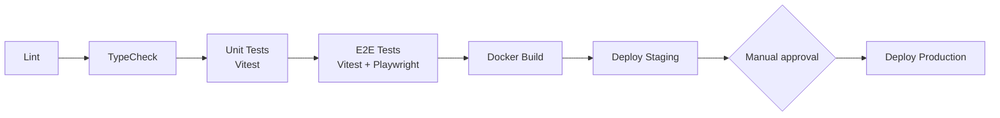

# ☁️ For After — Deployment & Infrastructure

> Where For After runs, how it is shipped, and what production needs. **Nothing is deployed yet**; this is the target
> design plus the requirements the built code already imposes.

| | |
|---|---|
| **Region** | AWS Sydney (`ap-southeast-2`), for Australian data residency |
| **Status** | ⬜ Staging and production not started (phases 26–27 in [task.md](task.md)) |
| **Related** | [Development guide](development-guide.md) · [Security](security.md) · [Incident response](incident-response.md) |

## 🧭 Contents

1. [Infrastructure components](#1-infrastructure-components)
2. [Domain architecture](#2-domain-architecture)
3. [CI/CD pipeline](#3-cicd-pipeline)
4. [Docker](#4-docker)
5. [Environment variables and secrets](#5-environment-variables-and-secrets)
6. [Production readiness blockers](#6-production-readiness-blockers)
7. [Monitoring and alerting](#7-monitoring-and-alerting)
8. [Backups](#8-backups)
9. [TLS](#9-tls)

---

## 1. Infrastructure components

| Component | Target |
|---|---|
| Marketing site | Managed WordPress hosting |
| Next.js frontend | Container on AWS ECS / App Runner, or Vercel |
| NestJS backend | Docker container on AWS ECS / App Runner |
| PostgreSQL | Managed (AWS RDS or Supabase), Sydney region |
| Redis | Managed (AWS ElastiCache or Upstash): sessions, OTP challenges, rate limits, BullMQ |
| Media (photo, audio, video) | ImageKit, private files and signed URLs (Phase 12). Legacy B2 bucket read-only for old rows |

---

## 2. Domain architecture

| Application | Domain | Platform |
|---|---|---|
| Marketing site | `forafter.com.au` | WordPress |
| User application | `app.forafter.com.au` | Next.js |
| API | `api.forafter.com.au` | NestJS |

All three share the `.forafter.com.au` cookie domain.

---

## 3. CI/CD pipeline

GitHub Actions, in this order:

---

## 4. Docker

- Multi-stage `Dockerfile` for the NestJS backend to keep images small and secure.
- Alpine or distroless Node.js base images.
- The BullMQ release worker currently runs inside the API process; a separate worker container is planned.

---

## 5. Environment variables and secrets

> 🔒 All secrets and configuration come from environment variables. **Never commit secrets.** In production, values
> are injected via AWS Parameter Store or AWS Secrets Manager (no `.env` files on servers).

### Required secrets (startup fails without them)

| Secret | Since | Notes |
|---|:--:|---|
| `SESSION_SECRET` | Step 2 | 32+ characters, different per environment |
| `DATABASE_URL`, `REDIS_URL` | Steps 1–2 | managed PostgreSQL / Redis (TLS: `rediss://`) |
| `RECIPIENT_OTP_PEPPER` | Step 13 | 32+ characters |
| `TRUSTED_CONTACT_OTP_PEPPER` | Step 14 | 32+ characters, **different** from the Recipient pepper |
| `IMAGEKIT_PUBLIC_KEY`, `IMAGEKIT_PRIVATE_KEY`, `IMAGEKIT_URL_ENDPOINT` | Phase 12 | a **separate production ImageKit account**; the private key is backend-only (never `NEXT_PUBLIC_*`) |
| `CLAMAV_HOST` (+ `CLAMAV_PORT`) | Phase 12B | a reachable clamd (e.g. the `clamav/clamav` image as a private service) with `CLAMD_CONF_StreamMaxLength` ≥ 110M; without it every upload fails closed (503) |
| `OBJECT_STORAGE_*` credentials | Step 7 | **legacy, optional**: only while live B2 rows remain (`docs/media-storage.md` §2c) |

### Production settings

| Variable | Production value |
|---|---|
| `NODE_ENV` | `production` (Secure cookies, trust one proxy hop) |
| `COOKIE_DOMAIN`, `RECIPIENT_COOKIE_DOMAIN`, `TRUSTED_CONTACT_COOKIE_DOMAIN` | `.forafter.com.au` |
| `FRONTEND_URL`, `WORDPRESS_URL` | production origins only |
| `EMAIL_PROVIDER` | `brevo` (transactional email → Brevo; startup refuses anything but `brevo`/`resend` in production) |
| `BREVO_API_KEY` | secret manager only; a v3 API key. Turn Brevo's authorised-IP blocking **on** (it is off for development) and add the production egress IPs |
| `EMAIL_FROM_ADDRESS` | an address on a For After domain authenticated in Brevo ([email setup](email-production-setup.md)) |
| `APP_BASE_URL` | `https://app.forafter.com.au` (https required) |
| `DEATH_VERIFICATION_SAFEGUARD_SECONDS` | `1209600` (14 days) or the approved value; **never** a testing value like 60 |
| `STORAGE_LIMIT_BYTES` | per-Customer storage limit; default 5 GiB (Phase 12C, approved 2026-10-08) |
| `MEDIA_MALWARE_SCAN_TIMEOUT_MS` | 120000 (download + scan of one file) |

### One-off tasks

- After deploying Step 13 over existing releases: `npm run backfill:access-grants` (dry run), then `-- --apply`.
- Step 14–15 migrations (`add_death_report_intake`, `death_report_owner_deletion`, `add_death_verification_workflow`)
  are additive; run `npx prisma migrate deploy`. Existing Step 14 cases are picked up by the death reconciler.
- Admin accounts: register, then set `User.role` to `ADMIN` in PostgreSQL (no sign-up path). Step 16 adds admin 2FA.
- Phase 12 media move (once per environment that still has B2 media): back up the database, set `IMAGEKIT_*` and
  `CLAMAV_HOST` (clamd running), `npx prisma migrate deploy`, then `npm run migrate:b2-to-imagekit` (dry run) and
  `-- --apply`; check each migrated row (private ImageKit file, size, signed `200` / unsigned refused) and that no live
  B2 row remains. Never `migrate reset` or `db push`. The B2 bucket stays as a backup until its deletion is approved.

---

## 6. Production readiness blockers

These must be solved before Recipients or Trusted Contacts can use production:

| Blocker | Why |
|---|---|
| **Email provider** for OTP and safety notices (Step 17) | With `disabled` mode, codes and safety notices are never sent, so the Recipient Portal, Trusted Contact sign-in and death verification cannot be used |
| **Admin 2FA** (Step 16) | Admins can verify deaths; production must not rely on a password alone |
| ~~**Death-case reopening rule**~~ ✅ | Resolved in Phase 10: a report after `CANCELLED`/`REJECTED` opens a new case ([death-verification.md](death-verification.md) §1.1) |
| **Throttler storage in Redis** | Register/login limits are counted in memory per instance |
| **Separate production media account** | Development uses the development ImageKit account; production needs its own keys (`IMAGEKIT_*`) |
| **clamd service** | Every upload is malware-scanned and fails closed; a deployed API needs a reachable clamd (`CLAMAV_HOST`) |
| **Deployed B2 media** | The Railway demo predates Phase 12: migrate its B2 rows to ImageKit before removing the legacy adapter |
| **Frontend** | Next.js app built locally (Steps 17–19) but not yet deployed; needs a CSP, the production cookie domain and the storage bucket CORS rule before launch ([task.md](task.md)) |

---

## 7. Monitoring and alerting

| Area | Tool |
|---|---|
| Telemetry, logs, traces | NestJS Observe (built in; enabled when keys are set) |
| Error tracking | Sentry (`@sentry/nestjs`), planned |
| Uptime | UptimeRobot, planned |
| Health checks | `GET /health/database`, `GET /health/redis` (built; custom controller) |
| Queue metrics | BullMQ dashboard, planned |
| Infrastructure | AWS CloudWatch (logs, CPU, memory) |

---

## 8. Backups

- **PostgreSQL:** automated point-in-time recovery (PITR).
- **Object storage:** bucket versioning against accidental overwrites/deletions.
- **Restore tests** are mandatory, not optional.

---

## 9. TLS

- All domains use HTTPS with TLS 1.3.
- Certificates managed by AWS Certificate Manager (ACM); the load balancer terminates TLS.
