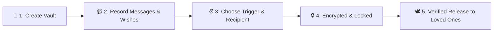

# 📄 For After — Product Requirements Document

> *Preserving what matters most, for after you're gone.*

A clear plan for what we’re building, why it matters, and how we’ll make it happen.

| | |
|---|---|
| **Build status** | Backend Steps 1–16 built (through death verification, death-trigger release and the admin backend); frontend Steps 17–19 built (Customer app, Recipient and Trusted Contact portals) |
| **Detailed brief** | [PROJECT_OVERVIEW.md](PROJECT_OVERVIEW.md) |
| **Progress** | [task.md](task.md) |

**Contents:** [01 Overview](#01--product-overview) · [02 Problem](#02--the-problem) · [03 Goal](#03--the-goal) ·
[04 Users](#04--target-users--user-needs) · [05 Features](#05--core-features) · [06 Journey](#06--how-it-works-the-journey) ·
[07 Portals](#07--three-application-portals) · [08 Plans](#08--plan-tiers--storage) ·
[09 Guardrails](#09--scope-guardrails--non-functional-requirements) · [10 Metrics](#10--success-metrics)

---

### 01 &nbsp; Product Overview

| Detail | Specification |
| :--- | :--- |
| **Product Name** | **For After** (`forafter.com.au`) |
| **Tagline** | *Your words, wisdom, and memories — delivered when it matters most.* |
| **Description** | A secure, cloud-based **Digital Legacy & Memory Vault SaaS Platform** where people can record video messages, write letters, document their life stories, and state final celebration-of-life wishes. The platform safely holds these memories and delivers them to chosen loved ones at specific future milestones or following confirmed passing. |
| **Domain Topology** | • **Marketing & Public Site**: `forafter.com.au` (WordPress)<br>• **Private Web Application**: `app.forafter.com.au` (Next.js & NestJS)<br>• **API Service**: `api.forafter.com.au` (REST / PostgreSQL / Redis) |

---

### 02 &nbsp; The Problem

People often leave behind unspoken love, untold life stories, unexpressed wishes, and disorganized digital lives. 

* **Untold Memories:** Most people want to speak to future milestones (e.g. child’s 18th birthday, marriage, graduations) if they are no longer here, but lack a private, dependable system to store and time-release messages.
* **Emotional Overwhelm for Families:** Families are often left guessing their loved one’s final wishes (songs, funeral preferences, who gets personal notes) during grief.
* **Risk of False Release or Premature Leaks:** Traditional scheduling systems can leak sensitive notes or fail over long periods (5–15 years). A system must be secure, respectful, and verified with human oversight.

---

### 03 &nbsp; The Goal

Enable everyday people to build their personal legacy vault in under 15 minutes, with 100% confidence that their heartfelt messages and memories will be delivered privately, securely, and accurately to the people they love.

---

### 04 &nbsp; Target Users & User Needs

#### 👥 Primary User Personas

* **Vault Owners (Account Holders):**
  Individuals planning ahead who want peace of mind knowing their spouse, children, and friends will receive guidance, love, and memories on important life occasions.
* **Recipients ("People I Love"):**
  Children, partners, relatives, or close friends who receive releases. They need an emotional, calm, distraction-free environment without complex account registrations or passwords.
* **Trusted Contacts:**
  1 or 2 individuals nominated by the Vault Owner who have authority to notify the platform of passing, provide documentation, and keep recipient contact details up to date.
* **Platform Administrators:**
  Human verification team responsible for reviewing death certificates/evidence, preventing false releases, and assisting families with care.

> #### 💜 User Need
> *"I want to know that if anything happens to me tomorrow, my children will still hear my voice on their wedding day, and my family will know exactly how I wanted to be remembered."*

---

### 05 &nbsp; Core Features

```
┌─────────────────┐   ┌─────────────────┐   ┌─────────────────┐   ┌─────────────────┐   ┌─────────────────┐
│       🎥        │   │       💌        │   │       📖        │   │       🕊️        │   │       🛡️        │
│  Video & Audio  │   │ Time & Milestone│   │  Life Story &   │   │ Celebration of  │   │  Human-Verified │
│  Memory Vault   │   │  Smart Release  │   │  Memoir Prompts │   │   Life Wishes   │   │Death Verification
│                 │   │                 │   │                 │   │                 │   │                 │
│Direct browser   │   │Birthdays, dates,│   │Childhood, career│   │Songs, readings, │   │Multi-contact    │
│recording & safe │   │future milestones│   │values & lessons │   │charity, notes   │   │grace period &   │
│HD streaming     │   │or post-death    │   │recorded easily  │   │stored neatly    │   │admin review     │
└─────────────────┘   └─────────────────┘   └─────────────────┘   └─────────────────┘   └─────────────────┘
```

#### Detailed Breakdown:

1. **Private Video & Audio Message Studio:**
   * Record directly from phone/laptop camera or upload existing media.
   * High-definition, smooth video streaming (via specialized video engine).
   * Supports **Video, Audio, Handwritten letters/photos, and Mixed media**.

2. **6-Step Message Creation Wizard:**
   * **Step 1:** Select Recipients (*Who is this for?*)
   * **Step 2:** Select Content Type (*Video, Voice, Letter, or Photos*)
   * **Step 3:** Record or Upload (*Direct in-browser recorder*)
   * **Step 4:** Add Title & Personal Context
   * **Step 5:** Set Delivery Trigger (*Immediate, Date, Milestone, or After Death*)
   * **Step 6:** Review & Securely Lock in Vault

3. **Message Lifecycle States:**
   * `DRAFT` ➔ Work in progress, not ready to be scheduled.
   * `SCHEDULED` ➔ Encrypted, locked, waiting for release condition.
   * `RELEASED` ➔ Securely delivered and accessible by recipient.
   * `CANCELLED` ➔ Revoked or cancelled by vault owner.

4. **Smart Release Schedule Types:**
   * `NOW` ➔ Immediate release to loved ones.
   * `FIXED_DATE` ➔ Exact future calendar date & time (e.g. Dec 25, 2030).
   * `BIRTHDAY` ➔ Annual recurring release on recipient's birthday.
   * `ANNIVERSARY` ➔ Annual recurring release on wedding/milestone date.
   * `CUSTOM_EVENT` ➔ Custom life milestone date.
   * `ON_DEATH` ➔ Released immediately once death is formally verified.
   * `AFTER_DEATH` ➔ Released relative time after death (e.g. +6 months, +1 year).
   * `ANNUAL_AFTER_DEATH` ➔ Recurring annually on death anniversary.

5. **Guided Life Story & Memoir Engine:**
   * Thoughtful question prompts across **Childhood, Family, Career, Values, and Hard-Earned Lessons** so everyone can leave a meaningful memoir.

6. **Celebration of Life & Wishes:**
   * Clear, organized non-legal wishes regarding music, burial/cremation preferences, ashes, charitable donations, and personal parting notes for loved ones.

7. **Loving, Passwordless Recipient Experience:**
   * Loved ones don't need to remember passwords or configure accounts.
   * Secure, respectful 6-digit one-time passcodes (OTP) sent directly to their email or mobile phone to open and view their memories.
   * ✅ *Built (Step 13): email codes and read-only released content. SMS and the email provider come later.*

8. **Compassionate & Secure Death Verification:**
   * Trusted contacts submit an official notification with supporting evidence.
   * An automated cooling-off period (14 days) and direct phone/email check-ins protect against accidental or fraudulent reports.
   * Final review by verified administrators before any posthumous vault unlock.
   * ✅ *Built (Steps 14–15): Trusted Contacts report by email-code sign-in; the account holder is notified and a
     configurable cooling-off period (default 14 days) runs; the account holder can confirm they are alive; an
     administrator verifies or rejects; only then are posthumous messages released. Evidence upload is still to come.*

---

### 06 &nbsp; How It Works (The Journey)



---

### 07 &nbsp; Three Application Portals

```
┌────────────────────────────────┐  ┌────────────────────────────────┐  ┌────────────────────────────────┐
│      1. CUSTOMER PORTAL        │  │      2. RECIPIENT PORTAL       │  │       3. ADMIN PORTAL          │
├────────────────────────────────┤  ├────────────────────────────────┤  ├────────────────────────────────┤
│ • Private Dashboard            │  │ • Clean, distraction-free view │  │ • Verification Queue review    │
│ • Manage "People I Love"       │  │ • Password-free access (SMS)   │  │ • Delivery monitoring & retries│
│ • Record & Schedule Messages   │  │ • Full HD private video player │  │ • Storage analytics & quotas   │
│ • Memory Vault & Life Story    │  │ • Downloadable personal letters│  │ • Strict security audit logs   │
│ • Manage Subscriptions & 2FA   │  │ • Re-accessible anytime        │  │ • Platform user support        │
└────────────────────────────────┘  └────────────────────────────────┘  └────────────────────────────────┘
```

---

### 08 &nbsp; Plan Tiers & Storage

| Plan Tier | Storage Allocation | Features & Media | Ideal For |
| :--- | :--- | :--- | :--- |
| **🌱 Essential** | **5 GB** | Key video messages, letters, essential wishes, up to 5 loved ones | Getting started with essential family messages |
| **⭐ Legacy (Standard)** | **25 GB** | Extensive video recordings, photo albums, complete guided life story | Comprehensive life legacy for growing families |
| **👑 Generations (Premium)** | **100 GB** | Unlimited milestones, extended video length, full archive of memories | Lifelong storytellers and extensive video diaries |

---

### 09 &nbsp; Scope Guardrails & Non-Functional Requirements

* **Platform Guardrail (MVP):** Responsive web application only. Fully optimized for both desktop and mobile web browsers. No native iOS/Android apps for V1.
* **Australian Data Sovereignty:** Hosted securely in Australia (AWS Sydney `ap-southeast-2`) complying with Australian Privacy Principles.
* **Bank-Grade Encryption:** All data encrypted both in transit (TLS 1.3) and in storage (AES-256).
* **Strict Confidentiality:** Content is locked — nobody (not even platform staff or nominated recipients) can view unreleased vault items before the verified release condition is met.
* **Availability & Reliability:** Target 99.9% uptime with automated point-in-time database recovery (PITR).
* **Zero Commercial Exploitation:** Private family vault, completely ad-free, with zero data-selling or tracking.

---

### 10 &nbsp; Success Metrics

* **Vault Completion Rate:** >75% of new users record at least 1 message and assign 1 recipient within 7 days.
* **Onboarding Satisfaction Score:** ≥ 4.8 / 5 on ease-of-use from non-technical users.
* **Delivery Reliability:** 100% on-time, verified delivery rate with zero duplicate or premature notifications.
* **User Retention:** >85% annual renewal rate on active legacy vaults.
