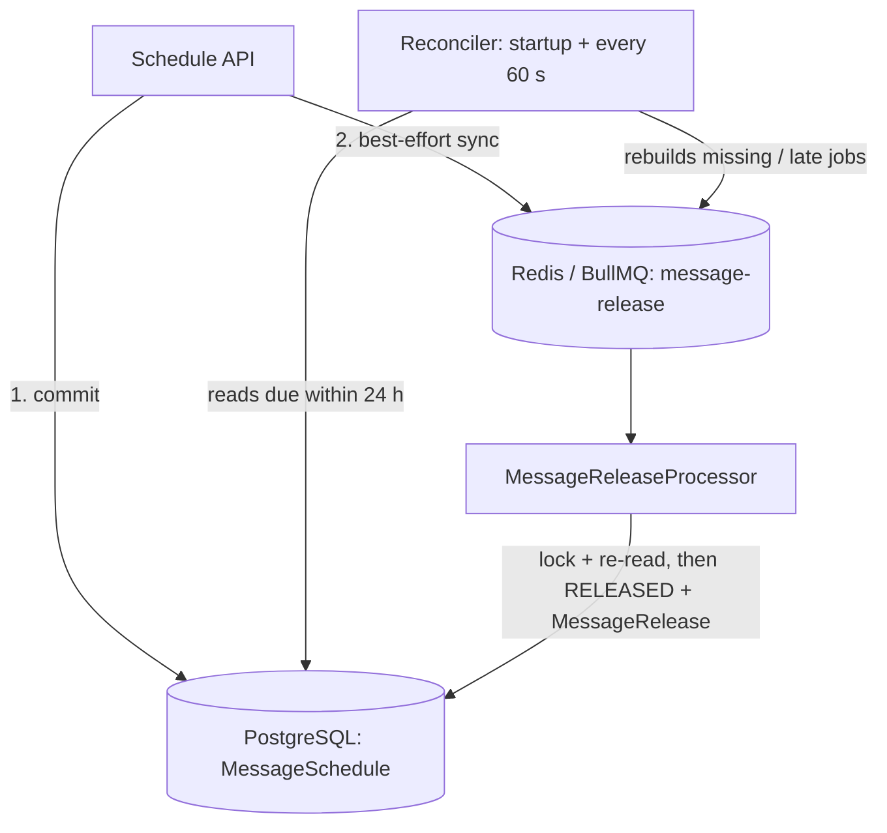

# ⏰ For After — Scheduling & Delivery Engine

> When messages are released: trigger types, how schedules are stored, and how the release engine runs them.

| | |
|---|---|
| **Built** | Schedules for `FIXED_DATE`, `ON_DEATH`, `AFTER_DEATH` (Step 6); `FIXED_DATE` execution (Step 12); `ON_DEATH` / `AFTER_DEATH` execution after an admin-verified death (Step 15) |
| **Not built** | Delivery (email/SMS), recurring triggers (`BIRTHDAY`, `ANNIVERSARY`, `CUSTOM_EVENT`, `ANNUAL_AFTER_DEATH`) |
| **Related** | [Message release](message-release.md) · [Death verification](death-verification.md) · [Message composition](message-composition.md) |

## 🧭 Contents

1. [Overview](#1-overview)
2. [Release trigger types](#2-release-trigger-types) · [2a What Step 6 implements](#2a-what-step-6-implements-and-does-not)
3. [Architecture (Step 12)](#3-architecture-step-12-release-execution)
4. [Queue configuration](#4-queue-configuration-implemented)
5. [Delivery processing (planned)](#5-delivery-processing-planned-not-built)
6. [Failure recovery](#6-failure-recovery-step-12)
7. [Idempotency](#7-idempotency)
8. [Timezone handling](#8-timezone-handling)
9. [Death-triggered scheduling](#9-death-triggered-scheduling)

---

## 1. Overview
Messages are scheduled for delivery on specific triggers. Some schedules are years in the future (5-15 years). Because of this long-term requirement, we cannot rely solely on in-memory Redis queues and must persist schedules durably.

## 2. Release Trigger Types
The `ReleaseTriggerType` enum defines the trigger conditions. All values exist in the database; the API accepts only the Step 6 ones.

| Type | Description | Step 6 |
|---|---|---|
| `NOW` | Immediate release | Reserved: no release engine or recipient access exists, so accepting it would claim a release that cannot happen |
| `FIXED_DATE` | Specific future instant | **Supported** |
| `BIRTHDAY` | Recurring annual on recipient's birthday | Reserved: needs decisions on timezone (recipient vs owner), time of day, 29 Feb, several recipients with different birthdays, recurrence |
| `ANNIVERSARY` | Recurring annual event | Reserved: needs the event date model and the same recurrence/timezone decisions |
| `CUSTOM_EVENT` | User-defined milestone | Reserved: needs an event model and who confirms the event |
| `ON_DEATH` | Released when death is verified | **Supported**; executed from Step 15 once an admin verifies the death |
| `AFTER_DEATH` | Released N days after the verified time of death | **Supported** as `afterDeathDays` 0-36,500; executed from Step 15 |
| `ANNUAL_AFTER_DEATH` | Recurring annual releases after death | Reserved: needs recurrence semantics and per-year occurrences |

## 2a. What Step 6 implements (and does not)
- `MessageSchedule` in PostgreSQL, **one per message** (unique `messageId`). PostgreSQL is the only source of truth: nothing is kept only in Redis, BullMQ or memory, and there is no `setTimeout`.
- API: `POST/GET/PATCH/DELETE /api/v1/messages/:messageId/schedule` (see `docs/api.md`).
- Status transitions, all server-side and atomic with the schedule change (Prisma transaction, conditional `UPDATE` on the message row first):
  - `DRAFT -> SCHEDULED` by creating the schedule (requires an own, non-deleted DRAFT message with at least one non-deleted assigned recipient, no schedule,
    and, since Step 8, a **complete composition**: see `docs/message-composition.md`. Checked inside the same transaction, after the message row is locked).
  - Schedule `PATCH` does not re-check composition: a SCHEDULED message's text, type and media cannot change, so it is still the validated one.
  - `SCHEDULED -> SCHEDULED` when editing the schedule.
  - `SCHEDULED -> DRAFT` by deleting the schedule (hard delete). This is *not* `CANCELLED`.
  - Only the release worker creates `RELEASED` (`FIXED_DATE` since Step 12; `ON_DEATH`/`AFTER_DEATH` since Step 15); `RELEASED`/`CANCELLED` messages cannot be scheduled, edited or unscheduled (409).
- `FIXED_DATE` needs an explicit offset (`Z` or `+hh:mm`); it is stored as a UTC instant and must be in the future when set.
- `ON_DEATH`/`AFTER_DEATH` schedules never check death themselves. They run only after Step 15 builds a `DeathTriggeredMessageActivation` from an admin-verified case.
- A database CHECK constraint enforces the per-trigger field rules, so no future code path can store an unsupported or contradictory schedule without a deliberate migration.
- Step 12 executes `FIXED_DATE`, Step 15 executes verified death triggers (see `docs/message-release.md`). Not built: delivery and notifications.
- A recipient soft-deleted *after* scheduling does not change the schedule. Step 12 re-checks at release time: with no live recipient left the message is not released and stays `SCHEDULED` (logged as `release_business_block`).

## 3. Architecture (Step 12: release execution)



- **PostgreSQL** is the only source of truth. Redis can be flushed or down without losing a schedule.
- **BullMQ** holds near-term execution jobs only: `FIXED_DATE` schedules and verified death-trigger activations due within `RELEASE_QUEUE_LOOKAHEAD_SECONDS` (24 h). Anything years away stays in PostgreSQL until the reconciler queues it.
- **Reconciler** (in-process timer, every `RELEASE_RECONCILE_INTERVAL_SECONDS`, and at startup) rebuilds missing, finished or too-late jobs; overdue schedules run immediately.
- **Worker** re-checks PostgreSQL under a row lock and releases atomically, or does nothing. It never trusts the job.
- Nothing is delivered: `RELEASED` is the backend state only. Email/SMS, recipient access and per-recipient `Delivery` rows are later steps.
- `ON_DEATH` / `AFTER_DEATH` are queued only from a `DeathTriggeredMessageActivation` of a `VERIFIED` case (Step 15); never from the schedule itself.

Full design, failure handling and manual tests: `docs/message-release.md`.

### Per-recipient resolution (future)
One message may target several recipients. For triggers such as `BIRTHDAY` each recipient can resolve to a different release date,
so the release engine will create per-recipient `ReleaseOccurrence`/`Delivery` rows. `MessageSchedule` is deliberately *not* duplicated per recipient.

## 4. Queue configuration (implemented)
Plain `bullmq` (no `@nestjs/bullmq`, so the queue name can come from config) with an ioredis connection from `QUEUE_REDIS_URL` or `REDIS_URL`.
The producer uses `enableOfflineQueue: false` and a 5 s timeout, so a Redis outage never hangs the scheduling API.
Jobs: id `message-release-<messageId>`, payload `{ messageId }`, `attempts` = `RELEASE_JOB_ATTEMPTS` (5), exponential backoff from
`RELEASE_JOB_BACKOFF_MS` (5 s, 10 s, 20 s, ...), completed jobs kept 24 h (max 1000), failed jobs 7 days (max 1000).

## 5. Delivery processing (planned, not built)
A later delivery step will, after release: create per-recipient delivery records, generate recipient access, dispatch email (Postmark) / SMS (Twilio),
record delivery status and audit. It will be a separate job type; release itself never sends anything.

## 6. Failure Recovery (Step 12)
- Transient errors (e.g. PostgreSQL down): the job throws and BullMQ retries with exponential backoff.
- Retries exhausted: logged (`release_retries_exhausted`); the message stays `SCHEDULED` (never `CANCELLED`/`FAILED`) and the reconciler queues it again.
- Stale jobs (unscheduled, deleted, trigger changed, death trigger without a verified activation) complete as no-ops; early jobs are re-delayed to the stored time.
- No dead-letter queue or admin alerting yet (open decision).

## 7. Idempotency
**Release (Step 12):** one `MessageRelease` per message (`UNIQUE messageId`), written with the status change in one transaction under a row lock; a repeated or concurrent job sees `RELEASED` and does nothing.

**Delivery (planned):**
To guarantee exact-once delivery, an `idempotencyKey` is used:
`idempotencyKey = ${messageId}-${recipientId}-${scheduleId}`
This is enforced as a `UNIQUE` constraint on the `deliveries` table in PostgreSQL.

## 8. Timezone Handling
- All timestamps are stored in **UTC**.
- Recurring rules (birthday, anniversary) store local timezone (e.g., `'Australia/Perth'`).
- The reconciliation worker calculates the next UTC occurrence dynamically based on the local time.

## 9. Death-Triggered Scheduling

*As built (Step 15).* A death report (Step 14) changes nothing. Only an **admin-verified** `DeathVerificationCase`
activates death triggers. Full workflow: [death-verification.md](death-verification.md).

```text
admin verifies (verifiedAt, verifiedDeathAt)
   → one DeathTriggeredMessageActivation per SCHEDULED ON_DEATH / AFTER_DEATH Message (dueAt)
   → message-release queue (Step 12) → MessageRelease + RecipientMessageAccessGrant (Step 13)
```

| Trigger | `dueAt` | Notes |
|---|---|---|
| `ON_DEATH` | `verifiedAt` | Released as soon as verification succeeds, not at the historical time of death |
| `AFTER_DEATH` | `verifiedDeathAt + afterDeathDays` (UTC days) | May already be overdue at verification → released promptly; `0` days = the time of death |
| `ANNUAL_AFTER_DEATH` | — | Not supported (deferred) |

> ℹ️ **Change from the original plan:** this doc previously said `dueAt = approvedAt + afterDeathDays`. Step 15 counts
> from the **approved time of death** (`verifiedDeathAt`), so "30 days after my death" means 30 days after the death,
> however long verification took.

`MessageSchedule.scheduledFor` keeps its `FIXED_DATE`-only meaning; death-trigger due times live on the activation.
